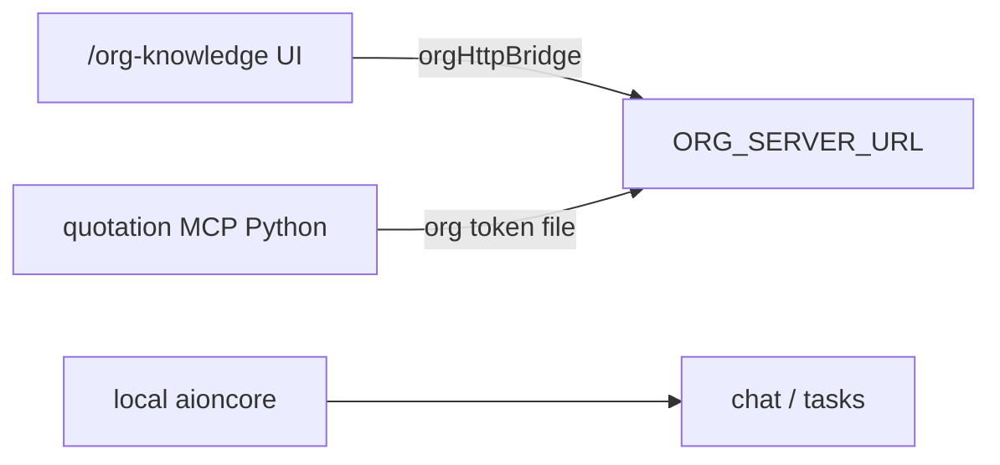

# Organization Knowledge (center aioncore)

> Shared Markdown knowledge for CCB-Wanding (~10 staff). **Center** org aioncore holds docs; employee desktop keeps **local** aioncore for chat and `/tasks`.

**Status:** Implemented 2026-06-11; **VPS production 2026-06-19** (`67.216.206.3:13401`, `aionorg.service`). **Phase 0 login linkage** shipped 2026-06-19 — see **[`org-knowledge-phase0-rollout.md`](./org-knowledge-phase0-rollout.md)**. **Unified org SSO** shipped + **pilot verified 2026-06-22** — see **[`unified-org-sso-rollout.md`](./unified-org-sso-rollout.md)** (`verify-sso-jit.ps1` PASS).

---

## Architecture

| Layer | Role |
|-------|------|
| **Local aioncore** (`127.0.0.1:__backendPort`) | Chat, cron, work-tasks — local JWT (`aionui-session-token`) |
| **Org aioncore** (`ORG_SERVER_URL`, e.g. `:13401`) | Org knowledge REST + org user JWT (`aionui-org-session-token`) |
| **Python MCP** | Reads org API via `admin/org_knowledge_client.py`; file fallback when offline |
| **Neon** | Not used for org MD knowledge (SQLite on org server) |



---

## Dual JWT contract (desktop)

### Unified SSO (`AIONUI_SSO_MODE=org-idp`) — target

| | Behavior |
|---|----------|
| Login | POST org `{ORG_SERVER_URL}/login` only; local `/login` and QR login return **403** |
| Token | **One JWT** → `aionui-session-token` + `org-session.token` (same string) |
| Local user | JIT `upsert_from_token` on first authenticated request (shared `JWT_SECRET`) |
| Ops onboarding | VPS account only — no per-machine local user creation |
| Config | `%LOCALAPPDATA%\CCB-Wanding\config\sso.env` loaded by `ccb-launch-aionui.cmd` |
| VPS | `/etc/aionorg/env` + **systemd drop-in** `aionorg.service.d/jwt-secret.conf` (see [`unified-org-sso-rollout.md`](./unified-org-sso-rollout.md)) |

> **Common mistake:** Writing `/etc/aionorg/env` without systemd `EnvironmentFile=` → org process keeps DB JWT secret → local 401. Verify with `grep JWT_SECRET /proc/$(pgrep -f aioncore.*13401)/environ`.

### Phase 0 fallback (`AIONUI_SSO_MODE=off` or unset)

| | Local | Org |
|---|-------|-----|
| Base URL | `getBaseUrl()` → `__backendPort` | `getOrgBaseUrl()` → `__orgServerUrl` |
| Token key | `aionui-session-token` | `aionui-org-session-token` |
| HTTP module | `httpBridge.ts` | `orgHttpBridge.ts` (must **not** import `getSessionToken`) |
| Python token file | — | `%APPDATA%/AionUi/aionui/org-session.token` (dev: `AionUi-Dev/aionui/…`) |
| Org URL config | — | env `ORG_SERVER_URL` or `%APPDATA%/AionUi/org-server.json` |

Independent login/logout in Phase 0; 401 on one domain clears only that domain's token.

**Phase 0 (2026-06-19):** After local login success, AionUI silently org-logins when `org-server.json` is configured (`orgAuthLogin.ts`). Employee org account on VPS must use **same username/password** as local login. Superseded by unified SSO when `sso.env` is configured.

**Agent write path (2026-06-19):** Quotation MCP exposes `append_business_rule` for confirmed chat-driven updates to shared `wanding_business_knowledge`. The tool reads center version, appends a dated rule block, and PUTs with `expected_version`; quotation-agent must ask for user confirmation before calling with `confirmed=true`.

---

## AionCore (org server)

| Item | Path |
|------|------|
| Crate | `AionCore/crates/aionui-org-knowledge/` |
| Migration | `015_org_knowledge.sql` |
| CLI CORS | `--cors-any` (JWT still required; **not** `--local`) |
| Start script | `scripts/start-org-aioncore.ps1` |
| Seed env | `AIONUI_ORG_KNOWLEDGE_SEED_DIR` → `data/*.md` (8 slugs) |

### REST (auth required)

| Method | Path | Notes |
|--------|------|-------|
| GET | `/api/org-knowledge` | List docs |
| GET | `/api/org-knowledge/{slug}` | Full doc |
| PUT | `/api/org-knowledge/{slug}` | `title`, `content`, `expected_version` → **409** on conflict |
| GET | `/api/org-knowledge/{slug}/history` | Revision list |
| GET | `/api/org-knowledge/{slug}/history/{version}` | Revision body |
| POST | `/api/org-knowledge/{slug}/revert` | `{ target_version }` |

WS event: `org-knowledge.updated` `{ slug, version }`.

### Seed slugs

`wanding_business_knowledge`, `ccb-wanding-claude-index`, `ccb-wanding-pricing-system`, `ccb-wanding-update-server`, `ccb-wanding-quotation`, `ccb-wanding-accurate`, `data-md`, `wanding-matching-architecture`.

---

## Python client

| File | Role |
|------|------|
| `python/admin/org_knowledge_client.py` | `load_doc_content()` API → file fallback |
| `python/main.py` | Selection context knowledge |
| `python/inventory/services/llm_selector.py` | Tier 0 org API before Neon/file |
| `python/inventory/services/wanding_fuzzy_matcher.py` | Field-matching rules from org API |
| `mcp_servers/quotation-server/dist/python-spawner.js` | Passes `ORG_SERVER_URL`, `ORG_SESSION_TOKEN_FILE` |

Env (MCP): `ORG_SERVER_URL`, `ORG_SESSION_TOKEN_FILE` (default `%APPDATA%/AionUi/aionui/org-session.token`; Python also reads `org-server.json`).

### Quotation MCP write tool

| Tool | Role |
|------|------|
| `append_business_rule` | Append a confirmed rule to center `wanding_business_knowledge` |

Contract:

- Without `confirmed=true`, returns `requires_confirmation: true` and does **not** write.
- With `confirmed=true`, requires org URL + org token and writes through `PUT /api/org-knowledge/{slug}`.
- Uses optimistic concurrency (`expected_version`); conflicts must be retried by re-reading center content, not force-overwritten.
- Used only when user explicitly asks to add/save a shared business rule. Routine quotation matching still uses `match_quotation` + local shadow Read.

---

## AionUI

| Item | Path |
|------|------|
| Org HTTP | `packages/desktop/src/common/adapter/orgHttpBridge.ts` |
| ipcBridge | `orgKnowledge.*` |
| Auth | `OrgAuthContext.tsx`, `orgAuthSession.ts` |
| UI | `#/org-knowledge` — list, editor, history, revert; offline = read-only |
| Sidebar | `SiderOrgKnowledgeEntry` — visible when `window.__orgServerUrl` set; below work-tasks; book icon when collapsed |
| E2E routes | `tests/e2e/helpers/bridge/routes.ts` (`base: 'org'`) |

### Shadow sync triggers (2026-06-19)

For slug `wanding_business_knowledge`, employee desktops keep the local Agent Read file fresh through:

| Trigger | Behavior |
|---------|----------|
| Org login success | Fetch center doc and write local shadow |
| `/org-knowledge` save/revert on this machine | Immediately write returned doc to local shadow |
| Org WS event `org-knowledge.updated` | If slug matches, fetch center doc and write local shadow |
| Foreground / visible window | Fetch center doc and write local shadow |
| 60s fallback interval | Fetch center doc and write local shadow |

This preserves the stable Agent Read path while making center edits propagate to online employees without requiring re-login.

---

## Deploy checklist

1. Build: `scripts/build-aioncore-work-tasks.cmd` (same binary includes org-knowledge).
2. **VPS (Linux):** `scripts/deploy-org-aioncore-vps.ps1` — tarball upload (**exclude `target/`**, ~50MB not ~9GB); SSH `scripts/vps-org-aioncore-bootstrap.sh`.
3. **Windows center / dev:** `scripts/start-org-aioncore.ps1` (`0.0.0.0:13401 --cors-any`).
4. Employee: `org-server.json` → `http://<center-ip>:13401`; create matching org user on VPS; **one local login** (Phase 0 linkage writes org token — separate org UI login optional).
5. CORS smoke: `fetch(ORG_SERVER_URL + '/api/org-knowledge', { headers: { Authorization: 'Bearer ' + orgToken }, credentials: 'omit' })` → 200.

**Phase 0 step-by-step (VPS + desktop, verified):** [`org-knowledge-phase0-rollout.md`](./org-knowledge-phase0-rollout.md).

**Do not** `scp -r AionCore` to Linux — includes Windows `target/` artifacts unusable on VPS.

**Step-by-step migration (center server + employee rollout):** **[`docs/org-knowledge-deploy.md`](../../docs/org-knowledge-deploy.md)**（独立运维手册，自包含）。

---

## Tests

```powershell
# SSO pilot gates (see unified-org-sso-rollout.md)
cd D:\Projects\claude-code-best
python scripts/org-phase0/_verify_jwt_crypto.py
.\scripts\org-phase0\verify-sso-jit.ps1

cd D:\Projects\claude-code-best\AionCore
cargo test -p aionui-auth -p aionui-db
cargo test -p aionui-auth sso -- --test-threads=1

cd D:\Projects\claude-code-best\python
python -m unittest admin.test_org_knowledge_client

cd D:\Projects\aionui-src
bun test tests/unit/common-auth/orgAuthLogin.test.ts tests/unit/common-adapter/orgHttpBridge.test.ts
```

Cross-reference: org login RBAC in [`aioncore-work-tasks.md`](./aioncore-work-tasks.md) § Desktop HTTP fetch.
