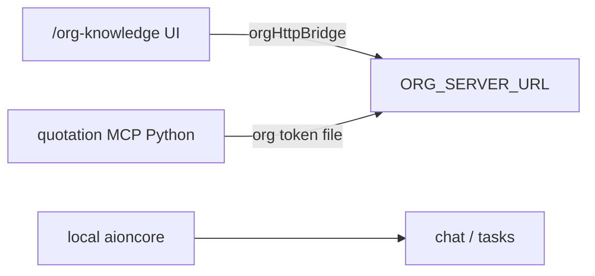

# Organization Knowledge (center aioncore)

> Shared Markdown knowledge for CCB-Wanding (~10 staff). **Center** org aioncore holds docs; employee desktop keeps **local** aioncore for chat and `/tasks`.

**Status:** Implemented 2026-06-11; **VPS production 2026-06-19** (`67.216.206.3:13401`, `aionorg.service`). **Router rewire + VPS smoke 2026-06-27** — org `/api/org-knowledge` returns **401** without JWT (was 404 when crate existed but `aionui-app` router omitted merge). **Phase 0 login linkage** shipped 2026-06-19 — see **[`org-knowledge-phase0-rollout.md`](./org-knowledge-phase0-rollout.md)**. **Unified org SSO** shipped + **pilot verified 2026-06-22** — see **[`unified-org-sso-rollout.md`](./unified-org-sso-rollout.md)** (`verify-sso-jit.ps1` PASS). **Agent write path MCP wired 2026-06-28** — `append_business_rule` in `quotation-server/dist/index.js`; shadow md **read-only** for agents (task [`06-28-org-knowledge-agent-write-path`](../../tasks/06-28-org-knowledge-agent-write-path/)). **MCP profile-strict JWT 2026-07-02** — shared `org_session.py` + `AIONUI_APPDATA_PROFILE` (task [`07-02-org-knowledge-dev-token-alignment`](../../tasks/07-02-org-knowledge-dev-token-alignment/prd.md)). Deploy: [`scripts/org-phase0/vps-org-api-deploy-checklist.md`](../../../scripts/org-phase0/vps-org-api-deploy-checklist.md).

---

## Architecture

| Layer | Role |
|-------|------|
| **Local aioncore** (`127.0.0.1:__backendPort`) | Chat, cron, work-tasks — local JWT (`aionui-session-token`) |
| **Org aioncore** (`ORG_SERVER_URL`, e.g. `:13401`) | Org knowledge REST + org user JWT (`aionui-org-session-token`) |
| **Python MCP** | Reads org API via `admin/org_knowledge_client.py`; file fallback when offline |
| **Neon** | Not used for org MD knowledge (SQLite on org server) |



---

## Dual JWT contract (desktop)

### Unified SSO (`AIONUI_SSO_MODE=org-idp`) — target

| | Behavior |
|---|----------|
| Login | POST org `{ORG_SERVER_URL}/login` only; local `/login` and QR login return **403** |
| Token | **One JWT** → `aionui-session-token` + `org-session.token` (same string) |
| Local user | JIT `upsert_from_token` on first authenticated request (shared `JWT_SECRET`) |
| Ops onboarding | VPS account only — no per-machine local user creation |
| Config | `%LOCALAPPDATA%\CCB-Wanding\config\sso.env` loaded by `ccb-launch-aionui.cmd` |
| VPS | `/etc/aionorg/env` + **systemd drop-in** `aionorg.service.d/jwt-secret.conf` (see [`unified-org-sso-rollout.md`](./unified-org-sso-rollout.md)) |

> **Common mistake:** Writing `/etc/aionorg/env` without systemd `EnvironmentFile=` → org process keeps DB JWT secret → local 401. Verify with `grep JWT_SECRET /proc/$(pgrep -f aioncore.*13401)/environ`.

### Phase 0 fallback (`AIONUI_SSO_MODE=off` or unset)

| | Local | Org |
|---|-------|-----|
| Base URL | `getBaseUrl()` → `__backendPort` | `getOrgBaseUrl()` → `__orgServerUrl` |
| Token key | `aionui-session-token` | `aionui-org-session-token` |
| HTTP module | `httpBridge.ts` | `orgHttpBridge.ts` (must **not** import `getSessionToken`) |
| Electron dev renderer → org VPS | **Must not** use renderer `fetch()` cross-origin (`localhost:5173` → VPS) | Use **`orgRawFetch` / `orgHttpRequest`** → main-process **`org-http-request` IPC** (2026-06-27) |
| Org auth verify | `OrgAuthContext` → `GET {ORG}/api/auth/user` via `orgRawFetch` | Same JWT as unified login; do not clear token on network/CORS errors |
| Org knowledge REST | `ipcBridge.orgKnowledge.*` → **`orgHttpGet/Put/Post`** → org VPS | **Not** local `httpGet` to `__backendPort` |
| Python token file | — | `%APPDATA%/AionUi/aionui/org-session.token` (dev: `AionUi-Dev/aionui/…`) |
| Org URL config | — | env `ORG_SERVER_URL` or `%APPDATA%/AionUi/org-server.json` |

Independent login/logout in Phase 0; 401 on one domain clears only that domain's token.

**Phase 0 (2026-06-19):** After local login success, AionUI silently org-logins when `org-server.json` is configured (`orgAuthLogin.ts`). Employee org account on VPS must use **same username/password** as local login. Superseded by unified SSO when `sso.env` is configured.

**Agent write path (2026-06-19; MCP wired 2026-06-28):** Quotation MCP exposes `append_business_rule` for confirmed chat-driven updates to shared `wanding_business_knowledge`. The tool reads center version, appends a dated rule block, and PUTs with `expected_version`; quotation-agent must ask for user confirmation before calling with `confirmed=true`. **Agents must not Edit/Write the local shadow md** — shadow is read-only; delete/full edit → `#/org-knowledge` UI.

---

## AionCore (org server)

| Item | Path |
|------|------|
| Crate | `AionCore/crates/aionui-org-knowledge/` |
| Migration | `015_org_knowledge.sql` |
| CLI CORS | `--cors-any` (JWT still required; **not** `--local`) |
| Start script | `scripts/start-org-aioncore.ps1` |
| Seed env | `AIONUI_ORG_KNOWLEDGE_SEED_DIR` → `data/*.md` (8 slugs) |

### REST (auth required)

| Method | Path | Notes |
|--------|------|-------|
| GET | `/api/org-knowledge` | List docs |
| GET | `/api/org-knowledge/{slug}` | Full doc |
| PUT | `/api/org-knowledge/{slug}` | `title`, `content`, `expected_version` → **409** on conflict |
| GET | `/api/org-knowledge/{slug}/history` | Revision list; each item includes `updated_by_id` + optional `updated_by: PublicUser` (username for UI) |
| GET | `/api/org-knowledge/{slug}/history/{version}` | Revision body; same `updated_by` enrichment |
| POST | `/api/org-knowledge/{slug}/revert` | `{ target_version }` |

WS event: `org-knowledge.updated` `{ slug, version }`.

### Seed slugs

`wanding_business_knowledge`, `ccb-wanding-claude-index`, `ccb-wanding-pricing-system`, `ccb-wanding-update-server`, `ccb-wanding-quotation`, `ccb-wanding-accurate`, `data-md`, `wanding-matching-architecture`.

---

## Python client

| File | Role |
|------|------|
| `python/admin/org_knowledge_client.py` | `load_doc_content()` API → file fallback |
| `python/admin/org_session.py` | **Shared** profile + JWT candidate resolution (price + knowledge; 2026-07-02) |
| `python/admin/org_http_csrf.py` | VPS double-submit CSRF bootstrap (`GET /api/auth/status` → `aionui-csrf-token` + `x-csrf-token` on PUT) |
| `python/main.py` | Selection context knowledge |
| `python/inventory/services/llm_selector.py` | Tier 0 org API before Neon/file |
| `python/inventory/services/wanding_fuzzy_matcher.py` | Field-matching rules from org API |
| `python/admin/org_knowledge_dispatch.py` | `append_business_rule` confirmation + write dispatch |
| `mcp_servers/quotation-server/dist/index.js` | **ListTools** must expose `append_business_rule` (wired 2026-06-28) |
| `mcp_servers/quotation-server/dist/python-spawner.js` | Passes `ORG_SERVER_URL`, `AIONUI_APPDATA_PROFILE`, `ORG_SESSION_TOKEN_FILE` |

### MCP `org_session` profile contract (2026-07-02)

**Problem:** Dev machines often have **two** AppData roots (`AionUi` packaged + `AionUi-Dev` from `start-dev-full`). Stale Prod JWT → `GET/PUT /api/org-knowledge/*` **401** while UI (Electron Dev store) still works. Read path masked by shadow md fallback; **`append_business_rule` has no write fallback**.

**Fix:** Shared `admin/org_session.py` + explicit profile env. Task [`07-02-org-knowledge-dev-token-alignment`](../../tasks/07-02-org-knowledge-dev-token-alignment/prd.md).

```
┌─────────────────────────────────────────────────────────────────┐
│  start-dev-full.ps1                                             │
│    $env:AIONUI_APPDATA_PROFILE = 'AionUi-Dev'                   │
│    sync-dev-wanding-vendor -UpdateSettings                        │
└────────────────────────────┬────────────────────────────────────┘
                             ▼
┌─────────────────────────────────────────────────────────────────┐
│  ccb-mcp.json (quotation MCP env)                               │
│    AIONUI_APPDATA_PROFILE = AionUi-Dev                          │
│    ORG_SESSION_TOKEN_FILE = %APPDATA%\AionUi-Dev\...\token      │
│    ORG_SERVER_URL = …                                           │
└────────────────────────────┬────────────────────────────────────┘
                             ▼
┌─────────────────────────────────────────────────────────────────┐
│  org_session.get_auth_candidates()  [STRICT]                    │
│    → single profile token file only                             │
│  org_knowledge_client._api_get / _api_json                      │
│    GET: 401 → next candidate (LEGACY_SCAN only)                 │
│    PUT: 401 → next; 403 CSRF → stop; 409 → version conflict     │
└────────────────────────────┬────────────────────────────────────┘
                             ▼
                    ORG_SERVER_URL :13401
```

| Env | Role |
|-----|------|
| `AIONUI_APPDATA_PROFILE` | `AionUi` (packaged default) or `AionUi-Dev` (dev launcher) |
| `ORG_SESSION_TOKEN_FILE` | `%APPDATA%/<profile>/aionui/org-session.token` — written by `ensure-wanding-settings.ps1` |
| `ORG_SESSION_TOKEN` | Optional strict override (inline JWT; single candidate) |
| `ORG_SERVER_URL` | Org API base; else read `<profile>/aionui/org-server.json` |

| Policy | When | Behavior |
|--------|------|----------|
| **STRICT** | `AIONUI_APPDATA_PROFILE` or `ORG_SESSION_TOKEN(_FILE)` set | One profile / one file; **no** cross-profile token scan |
| **LEGACY_SCAN** | None of the above (deprecated) | Try `AionUi` then `AionUi-Dev` on 401; logs WARN |

**PUT error boundaries (mutating writes):**

| HTTP | Action |
|------|--------|
| 401 | Try next JWT candidate (LEGACY_SCAN) or fail (STRICT) |
| 403 | `OrgCsrfError` — CSRF/RBAC; **do not** rotate JWT |
| 409 | `OrgVersionConflictError` — re-read `expected_version` at business layer |

**Packaged prod:** profile defaults to `AionUi`; single token file — behaviour unchanged.

Env (MCP): `ORG_SERVER_URL`, `AIONUI_APPDATA_PROFILE`, `ORG_SESSION_TOKEN_FILE` (path under `%APPDATA%/<profile>/aionui/org-session.token`). Python resolves JWT via shared `admin/org_session.py` (STRICT when profile or token file env is set; LEGACY_SCAN deprecated).

**Dev dual AppData (2026-07-02):** `start-dev-full` sets `AIONUI_APPDATA_PROFILE=AionUi-Dev`; `ensure-wanding-settings` writes matching MCP env. Do **not** point MCP at Prod token while logged into Dev — `append_business_rule` PUT has no shadow fallback (401 = write fail). **New Guid session** after settings sync (MCP subprocess does not hot-reload env).

**Diagnostic (dev):**

```powershell
$env:AIONUI_APPDATA_PROFILE = 'AionUi-Dev'
$env:ORG_SESSION_TOKEN_FILE = "$env:APPDATA\AionUi-Dev\aionui\org-session.token"
cd D:\Projects\claude-code-best\python
python -c "from admin.org_knowledge_client import get_doc; d=get_doc('wanding_business_knowledge'); print(d.get('source'), d.get('version'))"
# Expect: org-api <version>
```

Cross-ref price JWT: [`price-library.md`](./price-library.md) § Org JWT (same `org_session` module).

### Dev / smoke: 401 is expected (not a quotation bug)

| Context | Behavior |
|---------|----------|
| No org JWT / expired token / dev not logged in | `GET /api/org-knowledge/*` → **401** — smoke **PASS** (auth enforced) |
| Python `_api_get` | Catches HTTPError → logs warning → `None` (no MCP crash) |
| `load_doc_content()` | Org API first → **`fallback_path` local shadow md** when API unavailable |
| Quotation **price match** | Uses `org_price_client` / bundled seed — **independent** of org knowledge API |

401 means **center knowledge was not fetched** (may be stale vs VPS). It does **not** mean HDPE match is broken. For center-latest content + agent `append_business_rule`: dev login via `start-dev-full` (writes `%APPDATA%/AionUi-Dev/aionui/org-session.token`) then **new Guid session** after `-UpdateSettings`.

Cross-ref triage table: [`price-library.md`](./price-library.md) § Dev / smoke: expected degradations vs real bugs.

---

| Tool | Role |
|------|------|
| `append_business_rule` | Append a confirmed rule to center `wanding_business_knowledge` |

Contract:

- Without `confirmed=true`, returns `requires_confirmation: true` and does **not** write.
- With `confirmed=true`, requires org URL + org token and writes through `PUT /api/org-knowledge/{slug}`.
- **Mutating writes (2026-06-29):** Python client must send VPS **CSRF** per [`price-library.md`](./price-library.md) § VPS CSRF contract — `GET /api/auth/status` seeds `aionui-csrf-token` cookie; `PUT` sends `Authorization: Bearer` + `x-csrf-token`. Bearer alone → **403 `CSRF_INVALID`**.
- Uses optimistic concurrency (`expected_version`); conflicts must be retried by re-reading center content, not force-overwritten.
- Used only when user explicitly asks to add/save a shared business rule. Routine quotation matching still uses `match_quotation` + local shadow **Read** (never shadow Write).
- **Delete / full-doc edit:** not available via agent tool — use `#/org-knowledge` editor (PUT center); shadow resyncs on login/save/WS/interval.

### Preview UX — agent must not stop after `confirmed=false` (2026-06-29)

**Symptom:** Agent calls `append_business_rule` with `confirmed=false`, tool returns `requires_confirmation: true` + `rule_text`, then the chat **ends with no visible preview** — user sees only「先 confirmed=false 让你预览」and thinks the session「戛然而止」.

**Root cause:** MCP confirmation gate is intentional (wait for user「确认」before `confirmed=true`), but L1 lacked a post-tool synthesis rule like `get_product_price_tiers` has for price tables.

**Normative agent behavior after preview tool:**

| Step | Agent |
|------|-------|
| 1 | `append_business_rule` with `confirmed=false` |
| 2 | **Same turn** — assistant text: full markdown of `rule_text` +「将写入组织知识库，是否确认？」 |
| 3 | User replies「确认」/「同意」 |
| 4 | `append_business_rule` with `confirmed=true` (needs org token) |

**Shipped:** `ccb-installer/packages/vertical/com.wanding.trade/agents/quotation-agent.md` § `append_business_rule` 预览后（硬约束）+ §回复形态 + §硬禁止.

**Deploy verify:**

```powershell
.\ccb-installer\scripts\deploy-seed-agents.ps1 -ForceMd
# New quotation-agent Guid session → trigger append preview → must see full rule markdown + confirm question
```

---

## AionUI

| Item | Path |
|------|------|
| Org HTTP | `packages/desktop/src/common/adapter/orgHttpBridge.ts` |
| ipcBridge | `orgKnowledge.*` |
| Auth | `OrgAuthContext.tsx`, `orgAuthSession.ts` |
| UI | `#/org-knowledge` — list, editor, history, revert; offline = read-only |
| Sidebar | `SiderOrgKnowledgeEntry` — visible when `window.__orgServerUrl` set; below work-tasks; book icon when collapsed |
| E2E routes | `tests/e2e/helpers/bridge/routes.ts` (`base: 'org'`) |

### Shadow sync triggers (2026-06-19)

For slug `wanding_business_knowledge`, employee desktops keep the local Agent Read file fresh through:

| Trigger | Behavior |
|---------|----------|
| Org login success | Fetch center doc and write local shadow |
| `/org-knowledge` save/revert on this machine | Immediately write returned doc to local shadow |
| Org WS event `org-knowledge.updated` | If slug matches, fetch center doc and write local shadow |
| Foreground / visible window | Fetch center doc and write local shadow |
| 60s fallback interval | Fetch center doc and write local shadow |

This preserves the stable Agent Read path while making center edits propagate to online employees without requiring re-login.

**Shadow is read-only for agents (2026-06-28):** `quotation-agent` may **Read** the shadow path only. **Do not** Edit/Write/Bash the shadow file for shared updates — that changes one machine only and may be overwritten on the next sync. Append shared rules via MCP `append_business_rule`; delete or full-doc edit via `#/org-knowledge` UI.

### Vocabulary vs 价格库 (2026-07-11)

| 用户说法 | 含义 | Path |
|----------|------|------|
| **知识库** / **业务知识库** | 本页文档 / `wanding_business_knowledge` | `append_business_rule` 或 `#/org-knowledge` |
| **价格库** / **价库** | 物料单价 SKU 库 | `price-library-agent` — **not** this write path |

Contracts: `WANd.ROUTING.KB_ORG.001` / `KB_PRICE.001` / `KB_DISAMBIG.001` — task [`07-11-knowledge-vs-price-library-routing`](../../tasks/07-11-knowledge-vs-price-library-routing/).

---

## Common mistakes

| Wrong | Correct |
|-------|---------|
| 「知识库更新」→ `upsert_price_library_item` / `price-library-edit` | 知识库 = 业务知识库 → `append_business_rule` |
| Agent Edit/Write `vendor/.../wanding_business_knowledge.md` for fleet update | `#/org-knowledge` Save (delete/full edit) or MCP `append_business_rule` (append only) |
| Python has `append_business_rule` in `tool_dispatch` → assume MCP exposes it | Verify `mcp_servers/quotation-server/dist/index.js` ListTools + live `vendor/mcp-servers/.../index.js` after `sync-dev-wanding-vendor.ps1` |
| Changed `ccb-installer/packages/vertical/com.wanding.trade/agents/quotation-agent.md` only | Also `deploy-seed-agents.ps1 -ForceMd` — default deploy skips existing user `.md` |
| `#/org-knowledge` shows new content → assume quotation agent already has it | Shadow sync on login/WS/interval; **new MCP conversation** after vendor sync |
| `append_business_rule` for delete/test cleanup | Tool is **append-only**; use UI PUT for removals |
| `append_business_rule` → **403 CSRF_INVALID** | Re-login does **not** fix — MCP PUT needs CSRF bootstrap (`org_http_csrf.py`); sync `python/` → vendor after fix |
| `append_business_rule` → **401** with UI `#/org-knowledge` OK | MCP on **stale Prod** `org-session.token` while Dev login wrote `AionUi-Dev` — set `AIONUI_APPDATA_PROFILE=AionUi-Dev` + `-UpdateSettings` + **new Guid session** (task 07-02) |
| Re-login to fix `append_business_rule` 403 | 403 = missing CSRF on PUT, not expired JWT (GET would still work); deploy `org_knowledge_client` + `org_http_csrf.py` |

---

## Deploy checklist

1. Build: `scripts/build-aioncore-work-tasks.cmd` (same binary includes org-knowledge).
2. **VPS (Linux):** `scripts/deploy-org-aioncore-vps.ps1` — tarball upload (**exclude `target/`**, ~50MB not ~9GB); SSH `scripts/vps-org-aioncore-bootstrap.sh`.
3. **Windows center / dev:** `scripts/start-org-aioncore.ps1` (`0.0.0.0:13401 --cors-any`).
4. Employee: `org-server.json` → `http://<center-ip>:13401`; create matching org user on VPS; **one local login** (Phase 0 linkage writes org token — separate org UI login optional).
5. CORS smoke: `fetch(ORG_SERVER_URL + '/api/org-knowledge', { headers: { Authorization: 'Bearer ' + orgToken }, credentials: 'omit' })` → 200.
6. **Dev agent write path:** after repo changes to MCP or `quotation-agent.md` → `sync-dev-wanding-vendor.ps1` + `deploy-seed-agents.ps1 -ForceMd` → restart dev + **new quotation conversation**.

**Electron dev (Mixing, `localhost:5173`):** Browser CORS blocks renderer `fetch` to org VPS unless VPS runs `--cors-any`. **Do not rely on CORS in dev** — AionUI routes org login, org auth verify, and org knowledge REST through main-process IPC (`orgHttpProxy.ts`, channel `org-http-request`). Symptom: main login OK but `#/org-knowledge` shows「请从主登录页登录」→ `OrgAuthContext` still used renderer `fetch` (fixed 2026-06-27). See [`dev-sync-playbook.md`](./dev-sync-playbook.md) §4.8.

**Phase 0 step-by-step (VPS + desktop, verified):** [`org-knowledge-phase0-rollout.md`](./org-knowledge-phase0-rollout.md).

**Do not** `scp -r AionCore` to Linux — includes Windows `target/` artifacts unusable on VPS.

**Step-by-step migration (center server + employee rollout):** **[`docs/org-knowledge-deploy.md`](../../docs/org-knowledge-deploy.md)**（独立运维手册，自包含）。

---

## Tests

```powershell
# SSO pilot gates (see unified-org-sso-rollout.md)
cd D:\Projects\claude-code-best
python scripts/org-phase0/_verify_jwt_crypto.py
.\scripts\org-phase0\verify-sso-jit.ps1

cd D:\Projects\claude-code-best\AionCore
cargo test -p aionui-auth -p aionui-db
cargo test -p aionui-auth sso -- --test-threads=1

cd D:\Projects\claude-code-best\python
python -m unittest admin.test_org_session admin.test_org_knowledge_client
python -m unittest tests.test_quotation_mcp_tool_registry

cd D:\Projects\aionui-src
bun test tests/unit/common-auth/orgAuthLogin.test.ts tests/unit/common-adapter/orgHttpBridge.test.ts
```

| Check | Command | Pass |
|-------|---------|------|
| MCP registry | `python -m unittest tests.test_quotation_mcp_tool_registry` | `append_business_rule` in repo + vendor `index.js` |
| Org knowledge CSRF | `python -m unittest admin.test_org_http_csrf admin.test_org_knowledge_client` | bootstrap + PUT header |
| Org session profile | `python -m unittest admin.test_org_session` | STRICT single-profile; LEGACY_SCAN dedupe |
| Append dispatch | `tests.test_dispatch_error_codes` (append tests) | `requires_confirmation` without `confirmed=true` |
| Live vendor | grep `append_business_rule` in `D:\CCB-Wanding\vendor\mcp-servers\quotation-server\dist\index.js` | present after `sync-dev-wanding-vendor.ps1` |

Cross-reference: org login RBAC in [`aioncore-work-tasks.md`](./aioncore-work-tasks.md) § Desktop HTTP fetch.

**Recorded:** 2026-06-28 — MCP `append_business_rule` wired; agent shadow read-only; task [`06-28-org-knowledge-agent-write-path`](../../tasks/06-28-org-knowledge-agent-write-path/closure-2026-06-28.md).

**Recorded:** 2026-06-29 — MCP `append_business_rule` PUT CSRF fix (`org_http_csrf.py` + `org_knowledge_client._api_json`); aligns with `price-library.md` § VPS CSRF contract.

**Recorded:** 2026-06-29 — L1 hard constraint: after `confirmed=false` preview, quotation-agent must same-turn markdown-show `rule_text` + ask confirm (fixes empty-reply「戛然而止」); see § Preview UX.

**Recorded:** 2026-07-02 — **Profile-strict `org_session.py`** (shared with price client): `AIONUI_APPDATA_PROFILE` + MCP env from `ensure-wanding-settings` / `start-dev-full`; fixes `append_business_rule` 401 when Prod+Dev dual AppData coexist. Task [`07-02-org-knowledge-dev-token-alignment`](../../tasks/07-02-org-knowledge-dev-token-alignment/prd.md). Research: [`research/401-dual-token-2026-07-02.md`](../../tasks/07-02-org-knowledge-dev-token-alignment/research/401-dual-token-2026-07-02.md).
