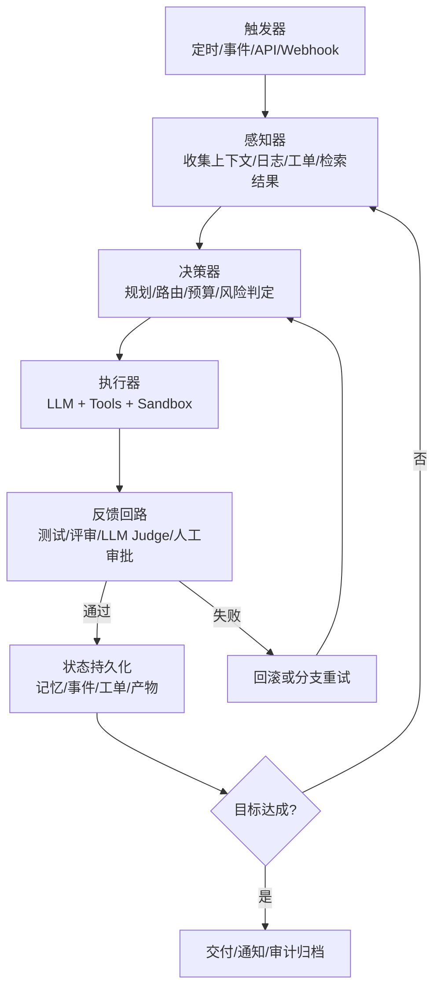
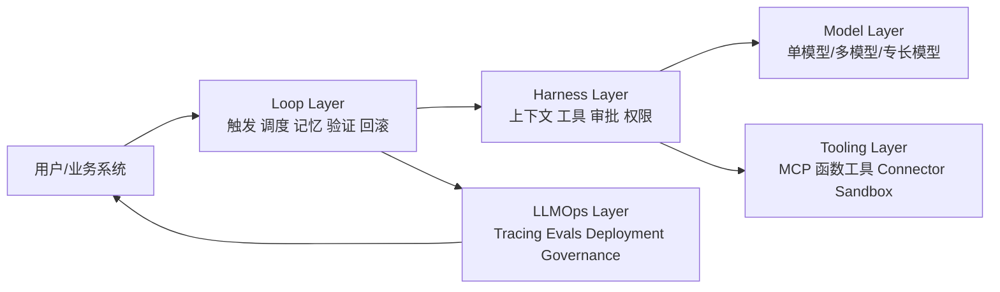

# Loop Engineering 深度研究报告

## 执行摘要

“Loop Engineering”在 2026 年迅速流行，但它更像一个**工程实践术语**，而不是已经在学界稳定定型的正式名词。就公开一手资料看，学术论文更常讨论 *agentic systems*、*multi-agent architecture*、*agent harness/scaffold*、*long-running agents* 与 *memory systems*；而“Loop Engineering”这个名字主要由 Addy Osmani 等工程作者系统化提出。其核心思想不是“把 prompt 写得更好”，而是**把人从逐轮 prompting 中抽离出来，改为设计一个能持续发现任务、分派任务、验证结果、记录状态并决定下一步的外环控制系统**。（Addy Osmani《Loop Engineering》：citeturn23view0；花叔《Loop Engineering 橙皮书》：citeturn22view0；Anthropic《Demystifying evals for AI agents》：citeturn15search9）

从工程边界看，**Agent** 是“带工具和状态的智能体”；**Harness** 是让模型成为 agent 的运行壳层，负责输入处理、工具调用编排和结果返回；**Loop Engineering** 则位于 Harness 之外，负责触发、并发、记忆、评审、回滚和运营节奏；**LLMOps** 进一步覆盖 tracing、eval、部署、治理与合规。换言之，Loop Engineering 是连接“单次智能调用”和“生产级 AI 运营”的运行时骨架，而不是 LLMOps 的替代品。（Anthropic《Building Effective AI Agents》：citeturn15search14；Anthropic《Effective harnesses for long-running agents》：citeturn15search2；LangGraph Overview：citeturn2search0）

本文的结论是：对技术负责人而言，Loop Engineering 最有价值的不是“自动化越多越好”，而是**把闭环做成可控、可审计、可回放、可评估、可限权的系统**。成熟实现通常具备八类能力：触发器、感知器、决策器、执行器、反馈回路、长期记忆、工具接口、监控审计；其最佳实践集中在上下文压缩、分支与回滚、maker-checker 分离、并发隔离、成本路由与 outcome-based eval。对于中小团队，应从单域单环开始；对于企业，应优先把权限边界、事件审计、评估基线和合规映射先搭好，再扩大自动化范围。（Anthropic《How we built our multi-agent research system》：citeturn31view2turn32view0；OpenAI Agents SDK：citeturn13search5turn9search4；NIST AI RMF：citeturn21search1turn21search3）

## 概念与边界

从工程定义出发，Addy Osmani 将 Loop Engineering 概括为：“你不再亲自逐轮提示 agent，而是设计一个会替你提示、检查、记忆和继续推进的系统。”他进一步把 loop 描述为一个递归目标系统：定义目标，AI 反复迭代直至完成。花叔的“橙皮书”把它说得更清楚：**Harness 负责一次 agent run，Loop 负责这个 run 何时被触发、是否并行、如何验证、如何记忆、是否继续。**这一定义与 Anthropic 对 harness/scaffold 的界定基本一致，后者将 harness 定义为使模型成为 agent 的系统层，而“评价 agent 本质上是在评价模型与 harness 的组合”。（Addy Osmani《Loop Engineering》：citeturn23view0；花叔《Loop Engineering 橙皮书》：citeturn22view0；Anthropic《Demystifying evals for AI agents》：citeturn15search9）

从学术视角看，虽然“Loop Engineering”这一命名尚未形成统一定义，但近年的 agent 综述和体系论文已经给出与之高度同构的结构：感知、脑/规划、行动、工具使用、协作与记忆。Anthropic 也把系统分成 workflow 与 agent 两类：前者沿预定义代码路径执行，后者由 LLM 动态决定下一步和工具使用。Loop Engineering 的实质，是把这些动态决策包装进一个**可持久运行、可重入、可观察、可治理**的外环里。（《Agentic Artificial Intelligence Architectures》：citeturn0search16；Anthropic《Building Effective AI Agents》：citeturn15search14）

它与 Agent、Harness、LLMOps 的关系可以用一句话概括：**Agent 是执行单元，Harness 是单元运行时，Loop 是单元外环协调器，LLMOps 是整个系统的运营与治理层。**LangGraph 官方把这一分层说得很直接：LangGraph 是 orchestration runtime，LangSmith 是 tracing/evaluation/prompts/deployment 平台；OpenAI 的 Agents SDK 也强调，SDK 负责 agent loop 和工具调用，而 deployment、state storage、approval decisions 仍由你的服务端掌控。（LangGraph Overview：citeturn2search0；OpenAI Agents Guide：citeturn2search1turn13search5）

下面这张图给出一个典型 Loop 的数据流与控制流。其关键不在“是否多 agent”，而在**是否存在清晰的完成条件、验证节点、持久状态和回滚点**。（Anthropic《How we built our multi-agent research system》：citeturn32view0；LangGraph Persistence/Time Travel：citeturn16search14turn16search2）

为了避免“术语套娃”，实践中建议采用下面的分层视图：Loop 负责任务连续性和闭环，Harness 负责单次 agent 运行的上下文、工具和权限，LLMOps 负责跨环境的版本、评测和治理。这也是为什么许多团队真正的瓶颈并不在模型本身，而在外环。Anthropic 明确指出：随着模型进步，很多 harness 假设会过时，因此外围系统必须保持可替换、可演化。（Anthropic《Scaling Managed Agents》：citeturn15search6turn8search17）

## 核心组件与架构模式

在生产实践里，Loop 最常见的最小闭环是“**触发—感知—决策—执行—验证—记忆**”。Anthropic 的 Research 系统、Claude Code /goal、OpenAI Agents SDK 的 handoffs+sandboxes+human review、LangGraph 的 persistence+time travel，实际上都在围绕这条主线构建。（Anthropic Research：citeturn32view0；Claude /goal：citeturn1search22；OpenAI Agents：citeturn26view0turn13search6；LangGraph：citeturn16search14turn16search2）

“触发器”决定 loop 为什么开始。它可以是 cron、代码仓库事件、工单状态变化、消息队列、人工按钮或达成条件未满足后的再入队。Claude Code 的 hooks 和 /goal、Pi 的会话命令、OpenHands 的 automations、OpenAI 的 runner/human review，本质上都在提供不同粒度的触发入口。（Claude Hooks：citeturn1search7；Pi Docs：citeturn29search9；OpenHands README：citeturn11view4；OpenAI Guardrails and human review：citeturn9search4）

“感知器”负责把环境信号变成可用于下一步决策的状态。学界与工业都在强调：agent 不是只看 prompt，它需要看工具结果、外部事件、历史轨迹、工件状态和检索证据。Anthropic Research 将子 agent 当作“智能过滤器”，先并行搜索，再把浓缩后的要点交回主 agent；OpenHands 则显式引入 condenser，把长上下文压缩成可继续推理的摘要状态。（Anthropic Research：citeturn32view0；OpenHands Condenser：citeturn16search5turn25search2）

“决策器”通常由一个 lead agent、planner 或 judge 组成，负责资源分配、工具选择、子任务切分与停止条件判定。Anthropic 在 Research 系统中使用 orchestrator-worker 模式，并发现一个好的 orchestrator prompt 至关重要：如果任务拆分边界不清，就会出现重复搜索、工具误选和资源浪费。Addy Osmani 也强调要把 maker 和 checker 分离，避免模型“自己给自己打分”。（Anthropic Research：citeturn32view0；Addy Osmani《Loop Engineering》：citeturn23view0）

“执行器”是最容易被低估的部分。它不只是调用模型，还涉及工具接口、权限边界、执行环境和副作用控制。OpenAI 已把 sandbox agents 做成原生能力；Anthropic 则把 code execution tool 定义为安全沙箱容器中的 Python/Bash 执行；AutoGen、CrewAI、OpenHands、Pi 都在不同程度上使用 Docker、微 VM 或外部 sandbox 服务来隔离运行。没有执行隔离，Loop 只能停留在“告诉你该做什么”，而不是真正闭环。（OpenAI Sandbox Agents：citeturn13search6turn13search2；Anthropic Code Execution Tool：citeturn1search13；AutoGen Docker executor：citeturn18search1turn18search10；CrewAI Code Interpreter/E2B：citeturn24search1turn24search5）

“反馈回路”决定系统能否从一次运行变成工程系统。常见做法有三类：静态规则校验、LLM judge、人工审批。Anthropic 在多 agent Research 中将 judge rubric 细化为事实准确性、引文准确性、完整性、来源质量和工具效率；OpenAI 在 SDK 中把 guardrails 与 human review 作为一等能力；LangGraph 则通过 interrupt / time travel 让人工审核和回放成为运行时能力，而不是事后补丁。（Anthropic Research：citeturn32view0；OpenAI Guardrails：citeturn9search2turn9search4；LangGraph HITL/Time Travel：citeturn2search14turn16search2）

“长期记忆”不能等同于“向量库”。2026 年的 Agent Memory 研究将其拆分为表示与存储、抽取、检索与路由、维护四个模块；Anthropic、LangGraph、OpenAI、CrewAI 都在提供不同层级的持久化：从短期 session memory、CLAUDE.md / auto memory、sandbox memory，到 graph store、vector store、memory tool。成熟 loop 的记忆层往往同时包含三类对象：**工作状态、过程结论、组织约束**。（《Are We Ready For An Agent-Native Memory System?》：citeturn0search20；LangGraph Persistence：citeturn16search14；Claude memory：citeturn13search0turn13search4；OpenAI sessions/memory：citeturn13search1turn13search13；CrewAI Memory：citeturn14search0）

“监控与审计”决定 Loop 能否进入企业环境。主流做法正在收敛到三种机制：**完整 trace、不可变事件流、可回放 checkpoint**。Replit 与 LangSmith 的联合案例表明，复杂 agent trace 往往有数百步，缺少 trace 搜索和 thread 视图时几乎无法调试；OpenHands 明确采用事件系统；LangGraph 则把 checkpoint/time travel 直接做成运行时能力。这些机制不仅用于调试，也用于责任归因和合规取证。（Replit × LangSmith：citeturn31view1；OpenHands Events：citeturn25search15；LangGraph Time Travel：citeturn16search6turn16search2）

## 常见实现技术与开源项目

公开生态里，Loop Engineering 已经不是“自写 bash 脚本”阶段，而是进入了**可组合 runtime + memory + sandbox + tracing** 的平台化阶段。下表优先采用官方仓库、官方文档和原始论文整理，表中的“是否支持安全沙箱/长期记忆”按**原生内建能力**判断；若需外接或仅部分支持，则标为“部分”。（LangGraph：citeturn11view0turn16search14；OpenAI Agents：citeturn26view0turn13search6；Claude Agent SDK：citeturn26view2turn26view3turn13search4；Semantic Kernel：citeturn11view2turn14search18；AutoGen：citeturn11view1turn18search1；CrewAI：citeturn11view3turn24search2turn24search3；OpenHands：citeturn30view0turn34search0；Pi：citeturn11view5turn29search0turn16search0）

| 项目 | GitHub 链接 | 功能定位 | 语言 | 许可 | 适用场景 | 多模型 | 安全沙箱 | 长期记忆 | 简短安装/运行说明 |
|---|---|---|---|---|---|---|---|---|---|
| LangGraph | `github.com/langchain-ai/langgraph` | 状态化 agent orchestration、durable execution、HITL、time travel | Python / JS | MIT | 长时、多步、可回放 workflow | 是 citeturn11view0turn2search0 | 否，需外接 citeturn11view0 | 是，checkpointer + stores citeturn16search14 | `pip install -U langgraph`；再接模型/工具与 checkpointer。citeturn11view0 |
| OpenAI Agents SDK | `github.com/openai/openai-agents-python` / `github.com/openai/openai-agents-js` | 轻量多 agent、handoffs、guardrails、tracing、sandbox agents | Python / TS | MIT | 产品内嵌 agent、voice、长任务 | 是，provider-agnostic/100+ 模型 citeturn26view0 | 是，原生 Sandbox Agents citeturn13search6turn13search2 | 是，Sessions + Sandbox memory citeturn13search1turn13search13 | Python: `pip install openai-agents`；TS: `npm install @openai/agents zod`。citeturn26view0turn27view0 |
| Claude Agent SDK | `github.com/anthropics/claude-agent-sdk-python` / `github.com/anthropics/claude-agent-sdk-typescript` | 复用 Claude Code 的工具、agent loop、context 管理 | Python / TS | MIT | 代码代理、CLI/IDE、长任务 | 否，Claude 生态为主 citeturn12search6turn26view3 | 部分，常配合 code execution tool/外部容器 citeturn1search13turn10search0 | 部分，memory tool、CLAUDE.md、auto memory/managed memory citeturn13search0turn13search4turn13search11 | Python: `pip install claude-agent-sdk`；TS: `npm install @anthropic-ai/claude-agent-sdk`。citeturn26view3turn26view2 |
| Semantic Kernel | `github.com/microsoft/semantic-kernel` | 企业中间件、plugins、agents、vector memory、process framework | Python / C# / Java | MIT | 企业集成、MCP/OpenAPI、业务流程编排 | 是，model-agnostic citeturn11view2 | 否，需外接执行环境 citeturn11view2 | 是，memory stores/vector stores citeturn14search18turn11view2 | `pip install semantic-kernel` 或 `.NET` 包；按 OpenAI/Azure 配置。citeturn27view1 |
| AutoGen | `github.com/microsoft/autogen` | 多 agent 研究/原型框架，含 AgentChat/Core/Studio | Python / .NET | MIT（代码）+ CC-BY（文档） | 研究、教学、原型、多 agent 对话 | 是 citeturn11view1 | 是，Docker/Jupyter 执行器 citeturn18search1turn18search10 | 部分，自定义 Memory protocol/ ListMemory citeturn14search3turn14search7 | `pip install -U "autogen-agentchat" "autogen-ext[openai]"`；Studio: `pip install -U autogenstudio`。citeturn11view1 |
| CrewAI | `github.com/crewAIInc/crewAI` | 角色协同 Crews + 事件驱动 Flows，带 guardrails/memory/observability | Python | MIT | 业务自动化、知识流程、低门槛多 agent | 是，多 provider / 本地模型 citeturn24search4turn24search0 | 部分，E2B/Modal/Code Interpreter 需配置 citeturn24search1turn24search5 | 是，统一 Memory 类 citeturn24search3 | `uv pip install crewai`；工具扩展 `uv pip install 'crewai[tools]'`。citeturn27view2 |
| OpenHands Software Agent SDK | `github.com/OpenHands/software-agent-sdk` | 面向软件工程 agent 的 SDK，REST/WS、Agent Server、security analysis | Python | MIT（enterprise/ 目录例外） | 代码代理、Agent Server、远程执行 | 是，多模型路由/LiteLLM citeturn25search0turn34search0 | 是，本地/ Docker / K8s ephemeral workspaces citeturn25search4turn30view0 | 部分，condenser/skills；统一持久记忆层未完全公开 citeturn25search2turn34search5 | `pip install -U openhands-sdk openhands-tools`；沙箱另装 `openhands-workspace openhands-agent-server`。citeturn30view0 |
| Pi Agent Harness | `github.com/earendil-works/pi` | 最小化 coding harness，会话树、skills、扩展、统一多 provider API | TypeScript | MIT | 终端 coding、树状会话、可扩展 loop | 是，OpenAI/Anthropic/Google/自定义 provider citeturn11view5turn29search4turn29search5 | 部分，建议外接 Gondolin/Docker/OpenShell citeturn11view5turn29search1 | 部分，会话树/插件化记忆；通用长期记忆需自建 citeturn16search0turn16search8 | `npm install -g --ignore-scripts @earendil-works/pi-coding-agent`；随后 `/login` 或设置 API key。citeturn29search0turn29search5 |

如果以“Loop Engineering 友好度”排序，而不是以“功能多寡”排序，我会把它们分成三层。**第一层**是 LangGraph、OpenAI Agents SDK、Claude Agent SDK、OpenHands：它们最适合做真正的闭环系统，因为要么具备持久执行与 checkpoint，要么具备原生 sandbox，要么已经把 tracing/HITL 做成一等能力。**第二层**是 Semantic Kernel 与 CrewAI：非常适合企业集成与业务编排，但高风险执行隔离通常仍需自己补上。**第三层**是 AutoGen 与 Pi：前者更偏研究与教学，后者更像极客友好的最小 harness，优点是透明和灵活，代价是你需要自己承担更多治理与平台工作。（相关官方资料同上：citeturn11view0turn26view0turn26view3turn30view0）

## 设计模式、评估与工程挑战

Loop 设计的第一原则是**把重复说明移出对话，写入稳定、可复用、可版本化的外部工件**。Anthropic 用 CLAUDE.md / auto memory，Pi 用 skills / package，CrewAI 用 agent/task/flow 配置，OpenHands 用 skills/context。这样做的价值不只是少写 prompt，而是把“组织约束”变成系统状态，降低每次 run 的意图丢失和推理漂移。（Claude Memory：citeturn13search0；Pi Skills：citeturn29search10；CrewAI docs：citeturn24search2；OpenHands Skills & Context：citeturn30view0）

第二原则是**上下文压缩优先于盲目长上下文**。Anthropic、OpenAI、OpenHands 都公开强调：长任务真正的问题不只是 token 窗口溢出，而是上下文膨胀后质量、延迟和成本同步恶化。OpenAI 给出 trimming 与 compression 两种短期记忆策略；Anthropic 将 compaction 视作长任务的一阶工具；OpenHands 用 condenser 保存关键状态并丢弃低价值历史。工程上最有效的方法通常是“最近若干 turn + 高保真摘要 + 外部状态文件”的三层结构。（OpenAI Session Memory / Compaction：citeturn17search0turn17search6；Anthropic Context Engineering：citeturn16search7turn16search3；OpenHands Condenser：citeturn16search5turn25search2）

第三原则是**天然支持分支/回滚和并发隔离**。Pi 的会话树、LangGraph 的 time travel、git worktree、OpenHands 的远程 workspace，本质上都在解决同一个问题：agent 会走错路，而“错路本身”必须可检查、可重演、可分叉。如果系统没有 checkpoint，失败就是全量重跑；如果没有 worktree/沙箱隔离，并发就会变成资源踩踏。（Pi Sessions：citeturn16search0turn16search8；LangGraph Time Travel：citeturn16search2turn16search6；Addy worktrees：citeturn23view0；OpenHands workspace：citeturn25search4turn30view0）

第四原则是**maker-checker 分离和预算显式化**。Anthropic 在 Research 系统中把 lead-agent、subagent、citation-agent 分工明确；Claude /goal 则在每轮后让另一小模型检查是否达成；Addy 也强调“写代码的人不该给自己的代码打分”。实践上，至少应把“生成”“验证”“审批”三个角色拆开，并在 prompt 或策略层明确 effort budget、tool budget、stop condition 和 escalation path。（Anthropic Research：citeturn32view0；Claude /goal：citeturn1search22；Addy Osmani：citeturn23view0）

评估方面，建议将指标分为六类。**准确性**用 outcome success / exact match / rubric score；**鲁棒性**看跨任务、跨工具、异常环境下成功率；**延迟**看端到端 wall-clock time 与工具等待时间；**token 成本**看每成功任务的 tokens / dollars；**可复现性**看是否能在固定环境下 replay；**安全性**看越权工具调用、数据泄露、保密违规和注入成功率。SWE-bench、GAIA、AgentBench、τ-bench、WebArena、CRMArena-Pro 分别覆盖代码修复、通用助手、交互 agent、工具-用户-策略约束、真实网页环境和企业流程/保密评估，是目前较有代表性的基准组合。（SWE-bench：citeturn5search12turn5search15；GAIA：citeturn5search1turn5search22；AgentBench：citeturn5search2turn5search8；τ-bench：citeturn6search4turn6search5；WebArena：citeturn6search2turn6search16；CRMArena-Pro：citeturn20search1turn20search15）

工程挑战集中在七个方面。**安全隔离**上，Anthropic 总结为“限制 blast radius”，通过进程沙箱、VM、文件系统边界和 egress controls 控制代理可达范围；**权限管理**上，需要让 agent 拿到任务所需的最小权限，而不是默认继承操作者全部权限；**数据泄露**与**工具滥用**上，OWASP 已明确把 prompt injection、tool abuse、memory risks 列为 agent 特有风险；**可扩展性**上，多 agent 带来的 token 消耗和调度复杂度会急剧增加；**可观测性**上，没有 trace 与 checkpoint 几乎无法定位非确定性问题；**模型漂移**上，Anthropic 明确指出 harness 的假设会随模型能力演进而过时；**合规**上，企业还需把审批链、数据分级与区域法规绑定到 loop。对策通常不是单点增强，而是“权限最小化 + 沙箱执行 + guardrails + 事件审计 + 稳定 eval 集 + 分级放权”的组合拳。（Anthropic Containment：citeturn10search0；OWASP AI Agent Security：citeturn9search9turn9search5；Anthropic Trustworthy Agents：citeturn20search0turn15search11）

## 案例研究

**Klarna** 是典型的业务流程型 loop 案例。其 AI Assistant 建在 LangGraph 之上，并借助 LangSmith 做 tracing、测试和 prompt 优化。架构上，它不是单轮客服问答，而是一个**可控路由的多 agent 系统**：请求先被分类和路由，再由特定子流程处理付款、退款和升级单。收益非常明确：官方案例称，9 个月内平均问题解决时间下降 80%，约 70% 的重复性支持任务被自动化，并能承担相当于 700 名全职员工的工作量。问题则集中在提示与场景适配复杂、测试样本必须持续扩充；其改进路径也很典型——把 observability 和 eval 提前，而不是等线上出问题后再补。（Klarna × LangGraph/LangSmith：citeturn31view0）

**Anthropic Research** 是典型的知识工作型 loop 案例。它采用 orchestrator-worker 架构：lead agent 制定研究计划、并行生成 subagents 搜索不同方向，最后由 citation agent 做证据定位。这个架构的关键收益不是“多 agent 更酷”，而是**把广度搜索与压缩总结分离**，让各子 agent 在各自上下文窗里独立探索，再把高价值 tokens 回传。Anthropic 报告称，在内部 research eval 上，lead 为 Claude Opus 4、subagent 为 Claude Sonnet 4 的多 agent 方案，相比单 agent Opus 4 提升 90.2%；但代价也极其明显：multi-agent 典型 token 用量约为普通 chat 的 15 倍。因此它适合高价值、强并行、强工具依赖任务，不适合强共享上下文的普通编码小任务。（Anthropic Research：citeturn32view0）

**OpenHands** 代表开源软件工程 loop 的另一条路线。其最新 Software Agent SDK 论文把旧版 OpenHands/ OpenDevin 的问题说得很清楚：早期版本是**单体架构 + 强绑定沙箱**，后续在支持本地执行、CLI 与多种 agent server 时变得笨重，促使团队进行一次彻底的模块化重构。新架构把 agent、workspace、tooling、server、security analysis 分开设计，并强调本地到远程执行可移植、多模型路由、内建安全分析和原生沙箱执行。收益是生产可组合性显著提升；当前公开问题主要仍在于长期记忆层与复杂协作策略仍需继续演进，且部分企业能力未完全开源公开。（OpenHands 论文与官方文档：citeturn34search0turn34search2turn30view0）

## 路线图与落地建议

对**中小团队**，建议从“单业务域、单条 loop、单一高价值动作”开始，例如工单归类、CI 失败归因、知识库更新、依赖升级建议；技术栈优先选用 LangGraph/OpenAI Agents SDK/Claude Agent SDK 这类能较快落地 checkpoint、guardrails 和 tracing 的框架。对**企业**，第一阶段就应定义权限域、事件模型、审批策略、审计留存和合规映射，否则扩展后会非常难补。NIST AI RMF、ISO/IEC 42001 与欧盟 AI Act 的落地经验都说明：治理要与设计同步，而不是系统上线后再写政策。（NIST AI RMF：citeturn21search1turn21search3；ISO/IEC 42001：citeturn21search12turn21search4；EU AI Act 时间线：citeturn21search2turn21search13）

一个可复制的团队画像通常包括：产品/领域负责人 0.5-1 名，平台工程师 1-2 名，应用工程师 1-3 名，ML/Prompt/Evals 工程师 1 名，必要时再加安全/合规支持。若没有专职 ML 角色，至少要有人负责**评测集、prompt/skill 版本、成本数据和异常复盘**，否则 loop 很快会变成“自动化地制造不稳定”。（Anthropic《Demystifying evals for AI agents》：citeturn20search16turn15search9）

预算上，公开价格能给出一个合理下界：OpenAI 与 Anthropic 当前 API 单价已显著下降，但 tracing、部署、沙箱和工程人力仍是主要成本；而 OpenHands Enterprise 等企业控制面价格多数为定制，公开资料未给出统一报价。基于当前官方定价与典型团队配置，下面的预算范围更适合作为**工程估算**而不是采购报价：低档 PoC 适合 1 条 loop、1 个数据域、现成 observability；中档适合部门级落地；高档则面向企业级多系统集成与合规改造。（OpenAI Pricing：citeturn19search0；Anthropic Pricing：citeturn19search1；LangSmith Pricing：citeturn19search3；OpenHands Pricing：citeturn19search2turn19search6）

| 档位 | 建议团队 | 典型目标 | 6 个月预算估算 |
|---|---|---|---|
| 低 | 3-4 人，小团队 | 单域 PoC，1-2 条 loop，接入现成模型与 SaaS tracing | **$30k-$80k** |
| 中 | 4-6 人，部门级 | 2-4 条生产 loop，加入审批、沙箱、评估与告警 | **$120k-$300k** |
| 高 | 8-15 人，企业级 | 多系统/多业务域、SSO/审计/合规、灰度放权 | **$400k-$1.2M+** |

### 六个月实施计划

| 月份 | 关键里程碑 | 交付物 |
|---|---|---|
| 第一个月 | 选定业务域与 North Star 指标；定义风险边界 | 需求文档、权限矩阵、初版 eval 集 |
| 第二个月 | 完成单 loop MVP | 最小闭环、基础 tracing、手动审批 |
| 第三个月 | 上线记忆与压缩层 | 状态存储、摘要策略、失败重试、成本面板 |
| 第四个月 | 引入并发与回滚 | worktree/沙箱、checkpoint、分支重跑 |
| 第五个月 | 做准生产扩展 | 自动化触发、告警、A/B prompt/skill 版本 |
| 第六个月 | 生产化与制度化 | SLA/SLO、权限分级、审计归档、值班与复盘机制 |

### 12 周敏捷冲刺计划

| 周次 | 目标 |
|---|---|
| 第 1 周 | 明确任务边界、成功标准、数据与权限范围 |
| 第 2 周 | 搭好基础 runtime、模型接入与最小工具集 |
| 第 3 周 | 完成第一个 end-to-end loop |
| 第 4 周 | 加入日志、trace、成本采集 |
| 第 5 周 | 建立 20-50 条种子 eval cases |
| 第 6 周 | 接入状态存储与上下文压缩 |
| 第 7 周 | 引入 maker-checker 与停止条件 |
| 第 8 周 | 接入沙箱/审批/最小权限控制 |
| 第 9 周 | 建立失败恢复、checkpoint、回放能力 |
| 第 10 周 | 做性能与成本优化，加入模型/工具路由 |
| 第 11 周 | 灰度发布，监控真实任务成功率与人工接管率 |
| 第 12 周 | 复盘并冻结 v1 规范：prompt/skill、eval、runbook、权限模板 |

## 未来趋势与研究方向

接下来两年的主线，几乎不会是“更多 agent 数量”，而会是**更好的 loop 自优化能力**。Anthropic 在多 agent Research 中已经展示了让 agent 帮助优化 prompt 和工具描述的做法；OpenAI 和 OpenHands 也都在把 tracing、sandbox memory、tool ergonomics 做成基础设施。这意味着未来 loop 会更多地靠**自动调参、策略学习、failure clustering 和 prompt/tool self-improvement**来演进，而不是纯人工调 Prompt。（Anthropic Research：citeturn32view0；OpenAI Agents SDK：citeturn26view0turn13search13；OpenHands SDK：citeturn34search0）

第二个趋势是**跨模型编排**。OpenHands、Semantic Kernel、OpenAI Agents SDK、Pi 都在朝 provider-agnostic 方向发展；这使 loop 不再绑定单模型，而是按角色分配模型：高价值决策用强模型，高频 triage 用便宜模型，验证器可用不同模型以降低同源偏差。工程上，这会把“模型选择”从一次性配置变成 loop 内的动态路由问题。（OpenHands 多模型路由：citeturn25search7turn34search0；Semantic Kernel：citeturn11view2；OpenAI Agents SDK：citeturn26view0；Pi Providers：citeturn29search5）

第三个趋势是**可验证性与法规合规**。CRMArena-Pro 已把 confidentiality awareness 纳入 benchmark；NIST AI RMF 和 ISO/IEC 42001 则在组织层面要求把可信、透明、风险控制与持续改进制度化；欧盟 AI Act 的时间线也在推动企业把 logging、risk management、human oversight 与 sandbox/testing 变成真实能力，而不只是 PPT。对 Loop Engineering 来说，这意味着下一阶段真正的门槛不是“做出一个会跑的 agent”，而是**做出一个能解释、能回放、能限权、能问责的 agentic system**。（CRMArena-Pro：citeturn20search1turn20search15；NIST AI RMF：citeturn21search1turn21search3；ISO/IEC 42001：citeturn21search12turn21search14；EU AI Act：citeturn21search2turn21search13）

最后，一个更长线的研究方向是**“memory as system substrate”**。2026 年的 agent memory 研究已经指出，长期记忆不是外挂的向量检索，而是与表示、路由、维护和成本协同演化的核心子系统。谁能把记忆层、评测层和权限层统一到 loop runtime 里，谁就更接近真正稳定的“循环工程”平台。到那时，Loop Engineering 很可能会从今天的工程流行语，逐步沉淀为下一代 Agent Runtime 的标准实践。（Agent-Native Memory 研究：citeturn0search20；LangGraph Persistence：citeturn16search14；OpenAI Sandbox memory：citeturn13search13）

 ┌────────────────────────────────┬─────────────────────────────────────────┐        
 │ 方面                           │ 当前判断                                │        
 ├────────────────────────────────┼─────────────────────────────────────────┤        
 │ Skill / Prompt 组织            │ 已经比较完整，但注册范围偏大            │        
 ├────────────────────────────────┼─────────────────────────────────────────┤        
 │ Tool / MCP action space        │ 较强                                    │        
 ├────────────────────────────────┼─────────────────────────────────────────┤        
 │ Agent routing                  │ 较强                                    │        
 ├────────────────────────────────┼─────────────────────────────────────────┤        
 │ Session identity               │ 较强，但恢复链较复杂                    │        
 ├────────────────────────────────┼─────────────────────────────────────────┤        
 │ Safety guard                   │ 较强                                    │        
 ├────────────────────────────────┼─────────────────────────────────────────┤        
 │ Memory system                  │ 有明显设计，不是简单聊天记忆            │        
 ├────────────────────────────────┼─────────────────────────────────────────┤        
 │ Recovery                       │ 做得很多，主要问题是复杂度              │        
 ├────────────────────────────────┼─────────────────────────────────────────┤        
 │ Observation                    │ 已经开始成型，还需要统一协议            │        
 ├────────────────────────────────┼─────────────────────────────────────────┤        
 │ Eval                           │ 有基础，但量化指标不足                  │        
 ├────────────────────────────────┼─────────────────────────────────────────┤        
 │ Deployment / live verification │ 有完整意识，但仍有 source/live 漂移风险 │        
 ├────────────────────────────────┼─────────────────────────────────────────┤        
 │ Platform compatibility         │ 当前存在 Agent dispatch 能力不一致      │         └────────────────────────────────┴─────────────────────────────────────────┘  