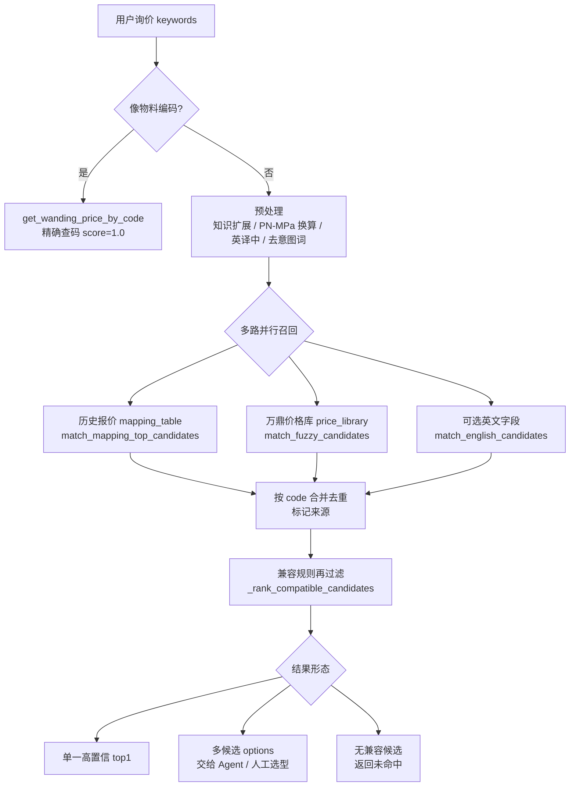

# 万鼎产品匹配架构说明

本文档描述 **代码层** 的产品匹配逻辑：从用户询价到候选 code 的完整路径。

与其他文档的分工：

| 文档 | 职责 |
|------|------|
| 本文档 | 匹配引擎架构、赋分、硬规则、多路并集 |
| `data/data.Md` | 价格库字段契约、清洗规则、PE 优先、兼容说明 |
| `data/wanding_business_knowledge.md` | Agent 在多候选时的 **语义选型**（代码无法穷举的部分） |
| `data/ccb-wanding-claude-draft.md` | Agent 工具调用流程、回复规范 |

---

## 1. 一句话概括

**骨架仍是「模糊匹配 → 赋分 → 候选列表」**；在此基础上叠加了三层增强：

1. **预处理**（编码直查、同义扩展、压力换算、英译中）
2. **硬规则门控**（品类/品牌/用途/规格不一致直接淘汰，不靠低分凑合）
3. **多源并集**（历史报价 + 万鼎价格库 + 可选英文路）

准确说法：**相似度负责「像不像」，硬规则负责「能不能是这条」，并集负责「从哪张表来的」。**

可以把这套架构理解成一条商品筛选流水线：

- **模糊匹配** 像先从仓库里把“看起来可能相关”的商品都捞出来。
- **硬规则门控** 像安检门，材质、用途、口径、压力、品牌不可能一致的直接拦掉，不让它们靠低分混进候选。
- **多源并集** 像同时查历史报价和标准价格库，最后按 `code` 汇总成一份候选清单。
- **Agent / 人工选型** 只处理剩下那些确实相近、代码层无法强行判断的语义选择。

---

## 2. 总体流程



```
用户询价 keywords
        │
        ▼
  ┌─────────────────┐
  │ 像物料编码？     │──是──▶ get_wanding_price_by_code（精确查码，score=1.0）
  └────────┬────────┘
           │ 否
           ▼
  ┌─────────────────┐
  │ 预处理           │  知识扩展 / PN↔MPa / 英译中 / 去意图词
  └────────┬────────┘
           ▼
  ┌─────────────────────────────────────────┐
  │ 多路并行（生产路径）                      │
  │  ├─ 历史报价 mapping_table 模糊匹配       │
  │  ├─ 万鼎 price_library 模糊匹配          │
  │  └─（可选）英文 Describrition_English    │
  └────────┬────────────────────────────────┘
           ▼
  ┌─────────────────┐
  │ 按 code 并集去重  │  标记来源：历史报价 / 字段匹配 / 共同
  └────────┬────────┘
           ▼
  ┌─────────────────┐
  │ 兼容规则再过滤   │  _rank_compatible_candidates
  └────────┬────────┘
           ▼
     候选列表 / top1 / 人工选型
```

---

## 3. 核心代码入口

| 场景 | 函数 | 文件 |
|------|------|------|
| 单条最佳匹配 | `match_wanding_price` → `match_fuzzy` | `python/inventory/services/match_and_inventory.py` |
| 带 score 的候选 | `match_wanding_price_candidates` → `match_fuzzy_candidates` | 同上 |
| 历史 + 万鼎并集 | `match_quotation_union` | 同上 |
| 英文询价 | `match_quotation_english` → `match_english_candidates` | 同上 |
| 底层模糊引擎 | `search_fuzzy` | `python/inventory/services/wanding_fuzzy_matcher.py` |
| 硬规则 | `_hard_filter_and_bonus` | 同上 |
| 精确查码 | `get_wanding_price_by_code` | 同上 |
| 历史报价模糊 | `match_mapping_top_candidates` | `python/inventory/services/mapping_table_matcher.py` |

Agent / MCP 侧通常调用 `match_quotation_union` 或 batch 版本，而不是直接调 `search_fuzzy`。

---

## 4. 预处理（进模糊前）

在 `match_fuzzy` / `match_fuzzy_candidates` 中，按顺序执行：

| 步骤 | 作用 | 示例 |
|------|------|------|
| 编码直查 | 输入形如 `8010036428`、`CP-UPMH-001` 时短路精确查码 | 避免把编码当描述 token 搜 |
| 知识扩展 | 读 `wanding_business_knowledge.md` 字段匹配段，补同义词 | 业务自定义 alias |
| 压力扩展 | PN ↔ MPa 双向追加 | `PN16` → 追加 `1.6MPa` |
| 英译中 | `QUERY_TERM_TO_CHINESE` 替换 | `drain` → 排水相关中文 |
| 去意图词 | 去掉「报价」「B级」等非品名词 | 避免污染 token 匹配 |

---

## 5. 模糊赋分（`search_fuzzy`）

### 5.1 Token 拆分

查询被拆成两类 token：

- **文字 token**：材质词、品类词（弯头、三通、AW…）
- **规格 token**：dn、英寸、长度等带数字的片段

规格 token 会走同义词 / 单位扩展（如 dn16 ↔ 1/2"），**压力 token（PN16、1.6MPa）不参与口径匹配**，避免 PN16 被当成 DN16。

### 5.2 得分公式

对每一行候选（通过硬规则后）：

```
hit_weight = 规格命中数 + 多字文字命中数 + 单字文字命中数 × 0.5
score      = hit_weight / total_weight + compat_bonus
```

- `total_weight`：查询侧所有 token 的加权个数
- `compat_bonus`：硬规则层给出的加分（见下节）
- 同一 code 保留最高分；最终按 score 降序

### 5.3 候选裁切

`match_fuzzy_candidates` 额外支持：

- `max_candidates`：最多返回条数
- `max_score_tiers`：取前 N 个分数档的全部候选（常用 2 档）
- `min_score`：最高分低于阈值 → 视为未命中
- `min_score_gap`：top1 与 top2 分差过大 → 只保留 top1

---

## 6. 硬规则门控（`_hard_filter_and_bonus`）

硬规则 **不是低分惩罚，而是直接淘汰**（`return False`）。通过时可能加 `bonus` 提高排序。

### 6.1 品牌 / 产品线

| 查询特征 | 规则 |
|----------|------|
| 含 `RUCIKA` | 只保留 `product_type` 含 RUCIKA 的行（STANDARD / JIS） |
| 不含 `RUCIKA` | 排除 RUCIKA 品牌行，避免与 LESSO AW 白管混淆 |
| 含 CEILING 触发词 | 只保留 CEILING 产品；并做子类隔离（见下） |

CEILING 触发词包括：`ceiling`、`main hollow`、`stelldrat`、`steel drat`、`soldays`、`dynabolt`、`mur soldays`。

CEILING 子类（互不混匹）：

- main hollow / stelldrat / dynabolt / mur / panel / hook

### 6.2 材质与用途

| 维度 | 示例 |
|------|------|
| 材质 | PVC / PPR / PE / HDPE 不一致 → 淘汰 |
| 用途 | 给水 vs 排水 vs 穿线管 → 淘汰 |
| 品类 | 查弯头却命中管材 → 淘汰 |
| 冷热水 | 热水管 vs 冷水管 → 淘汰 |

### 6.3 规格

| 维度 | 行为 |
|------|------|
| 口径 dn / 英寸 | 查询有明确口径时，候选口径集合必须相交 |
| 复合规格 A×B | 如 dn32×1/2"，主副径都要对 |
| 压力 PN / MPa | PN16 与 1.6MPa 等价；压力不匹配 → 淘汰 |
| 长度 | 如 100M vs 50M 不一致 → 淘汰 |
| 弯头角度 | 45° / 90° 不一致 → 淘汰 |
| PE 电熔 | 未明确要电熔时，默认排除电熔件 |

### 6.4 与 Agent 知识库的分工

`wanding_business_knowledge.md` 中写明：**材质、用途、品类、口径、压力等确定性规则已在代码层实现**。Agent 只在多候选语义接近时做 tie-break（如热/冷、半弯/全弯、来源加权）。

---

## 7. 多路并集（生产路径）

`match_quotation_union` 并行执行：

1. **历史报价** — `match_mapping_top_candidates`（同一套 token 模糊思路，映射表无单价）
2. **万鼎字段匹配** — `match_fuzzy_candidates`（`max_score_tiers=2`）

合并逻辑（`_merge_candidates_by_code`）：

- 按 `code` 去重
- 同一 code 两边都命中 → `source = 共同`
- 单价优先用万鼎价格库；名称优先用万鼎规范名
- 历史命中但单价为 0 → 用 `get_wanding_price_by_code` 补价

合并后再走 `_rank_compatible_candidates`：对每条候选重新跑硬规则，过滤不兼容项，按 `(兼容 bonus, 来源优先级)` 排序。

来源优先级：`共同` > `历史报价` > `字段匹配` / `英文字段匹配`。

---

## 8. 英文匹配路

`match_english_candidates` 用于英文 / 印尼文询价：

1. 将 keywords 拆成 token（长度 ≥2，或单独数字规格）
2. 要求 **全部 token** 出现在 `Describrition_English`（小写 CONTAINS）
3. 对命中行应用 `_hard_filter_and_bonus`，按 bonus 排序

不走中文 token 分词，但与中文路 **共用同一套硬规则**（RUCIKA、CEILING 等）。

---

## 9. 数据源与加载

默认价格库：`data/price_library_cleaned_2026_05_15.xlsx`（sheet `price_library`）

加载规则（详见 `data/data.Md`）：

- 只加载 `is_preferred_price = TRUE`
- PE PIPA 与旧 LESSO 重合编码时，PE 行为 preferred
- 匹配文本 = `description` + `description_cn` + `description_english` + `product_type`
- 适配到旧列名：`Material`、`Describrition`、`Describrition_English`、`Product_Type`、`unit_price`

旧库 fallback：`data/wanding_price_lib.xlsx`（新库空或缺失时）

缓存按 **文件路径** 隔离，同进程查新表 + 旧表不会串 profit / 匹配缓存。

---

## 10. 输出形态

| 调用 | 返回 |
|------|------|
| `match_fuzzy` | 单条 `{code, matched_name, unit_price}` 或 `None` |
| `match_fuzzy_candidates` | `[{code, matched_name, unit_price, score}, ...]` |
| `match_quotation_union` | 并集候选，带 `source`（matcher 层最多约 20 条，合并排序后） |
| `match_price_and_get_inventory` | **Internal Python only** — fill/extract flow; **not** MCP-exposed (2026-06-29). Agent price+stock: `match_quotation` → `get_inventory_by_code`. |

### 10.1 MCP 层 selection payload（`python/main.py`）

`match_quotation` / `match_quotation_batch` 在 union 结果外包一层 `_build_selection_payload`，供 Agent 选型（MCP 不 auto-pick）：

| 字段 | 说明 |
|------|------|
| `candidate_count` | 匹配器返回的总候选数 |
| `candidates_returned` | 本次 JSON 中实际附带的条数 |
| `candidates_truncated` | 总数 > 返回数时为 `true` |
| `candidates` | 截断后的列表（默认最多 **7** 条；`show_candidates: true` 时最多 **15** 条） |
| `selection_context.knowledge_source` | `wanding_business_knowledge.md` 路径，Agent **按需 Read** |
| `selection_context` | **不含**内联知识库全文（2026-06-17，避免 batch 体积爆炸） |

**不满意某一条**：对该 `keywords` 单独 `match_quotation` + `show_candidates: true`，不要整批重跑 `match_quotation_batch`。

---

## 11. 典型查询走法（示例）

| 用户输入 | 走路径 | 关键点 |
|----------|--------|--------|
| `8010036428` | 编码直查 | 不进入 fuzzy |
| `HDPE dn20 1.6MPa 100M` | fuzzy + 压力/口径/长度规则 | PE PIPA preferred 价 |
| `PIPA RUCIKA STANDARD AW 1/2" SC 4M` | fuzzy + RUCIKA 品牌门控 | 不会落到 LESSO AW DN16 |
| `Main hollow 38` | fuzzy + CEILING 门控 + 子类 | 不会落到 PVC 电工 H38 |
| `Steel drat SOLDAYS M5 3 meter` | fuzzy + CEILING + stelldrat 子类 | 英文描述也能触发 |
| `PVC-U AW DN16 4M white` | fuzzy + 材质/用途 | LESSO AW 白管 |
| 英文短词 `RUCIKA AW 3/4` | 英文 CONTAINS + 硬规则 | 按 bonus 排序 |

---

## 12. 已知边界（设计取舍）

1. **短查询歧义**：如 `PVC-U AW white 4M` 信息不足时，可能稳定命中某一默认规格（如 DN16），不一定是「错」，而是查询太模糊。
2. **截断描述**：只用 description 前 60 字做查询时，信息丢失会导致 miss。
3. **英文 CONTAINS**：全 token 包含是必要条件，不做 fuzzy 加权；靠硬规则排序区分近义候选。
4. **历史表无单价**：必须回查万鼎库补价。
5. **Agent 层**：多候选且语义仍接近时，由 `wanding_business_knowledge.md` 指导人工/LLM 选型，代码不强行 auto-pick。

---

## 13. 回归测试

| 脚本 | 覆盖 |
|------|------|
| `python/test_wanding_matcher_compat.py` | 品类/口径/冷热水/PE 电熔等单元场景 |
| `python/test_price_library_real.py` | 对新价格库的真实描述回归（RUCIKA、CEILING、PE、编码直查等） |

运行：

```powershell
cd d:\Projects\claude-code-best\python
python test_wanding_matcher_compat.py
python test_price_library_real.py
```

---

## 14. 变更记录

| 日期 | 变更 |
|------|------|
| 2026-06-17 | MCP selection payload：默认每行 7 候选、`show_candidates` 时 15；移除内联知识库；`match_quotation_batch` **每批最多 10 行**，返回 `{ results, items_truncated, remaining_keywords? }` |
| 2026-06-08 | 初版：梳理模糊+赋分+硬规则+并集架构；Document RUCIKA / CEILING / 编码直查 / PE 优先数据源 |
