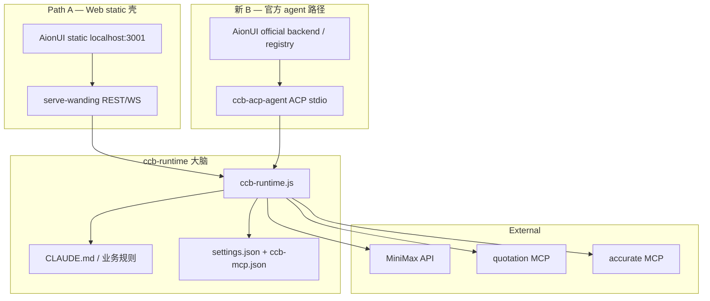

# CCB Runtime + ACP Agent + AionUI Client — 可行性计划

**日期**: 2026-06-11  
**状态**: v1.4 评审修订  
**关联文档**:

- [ccb-wanding-aionui-architecture-evaluation.md](./ccb-wanding-aionui-architecture-evaluation.md) — 路径评估与旧 B 调用链
- [思路5.md](./思路5.md) — AionUI 主体 + CCB MCP（短期备选）
- [../ccb-installer/思路三改造.Md](../ccb-installer/思路三改造.Md) — Path C 风险清单
- [../ccb-installer/AIONUI-BACKEND-STATUS.md](../ccb-installer/AIONUI-BACKEND-STATUS.md) — 实测进度日志
- [../spec/aionui-ccb-wanding-acp-mcp-fix.md](../spec/aionui-ccb-wanding-acp-mcp-fix.md) — 旧 B 补丁 spec（归档参考）

---

## 0. 摘要

### 0.1 终极方案定义

**正式命名**: **CCB Runtime + ACP Agent + AionUI Client**

核心分层：**一个 `ccb-runtime` 大脑 + 两个 adapter 薄壳**（Path A HTTP、新 B ACP）。  
**禁止**把两条 AionUI 接入面混为同一条集成路径。

```text
                    ┌── Path A（Web static 壳）
                    │   AionUI static @ localhost:3001
                    │     → serve-wanding REST/WS
                    │     → ccb-runtime
                    │
AionUI 接入面 ──────┤
                    │
                    └── 新 B（官方 agent 路径，长期正式版）
                        AionUI Desktop/Web official backend
                          → agent registry / ACP stdio
                          → ccb-acp-agent
                          → ccb-runtime
                                    ↓
                        MiniMax + quotation/accurate MCP + 业务规则
```

| 链路 | 接入面 | Adapter | 目标用户场景 |
|------|--------|---------|--------------|
| **Path A** | AionUI **预编译 static** + 自定义 HTTP/WS | `serve-wanding.js` | 浏览器 `localhost:3001`、快速验证 runtime |
| **新 B** | AionUI **官方 backend / agent registry** | `ccb-acp-agent.js` | Desktop/Web 原生 ACP、长期生产 |

两条链路**共享 `ccb-runtime`**，不共享 transport 协议。

### 0.1.1 ccb-runtime 复刻标准（已确认）

**一句话**: `ccb-runtime` **不是**复刻旧 CLI 的所有代码，而是复刻 **CCB-Wanding 的「业务 Agent 行为」**。

复刻标准是**行为与能力对齐**，不是把 `main-*.js` / `print-*.js` 等 minified 代码原样搬过来。

#### 要复刻什么（业务能力清单）

`ccb-runtime` 应尽量复刻以下能力：

| # | 能力 | 说明 |
|---|------|------|
| 1 | **System prompt / 业务规则加载** | `CLAUDE.md`、`settings.json`、万鼎业务知识路径 |
| 2 | **MiniMax 模型调用逻辑** | `ANTHROPIC_*` 配置、模型选择、请求/响应处理 |
| 3 | **quotation / accurate MCP 接入** | 读配置、启动 MCP、tools/list、tools/call |
| 4 | **工具调用循环** | `tool_use` → MCP `tool_result` → 再交回模型 |
| 5 | **多轮 agent loop** | 多步推理、连续 tool 调用直至 `end_turn` |
| 6 | **文件、知识库、规则读取** | 价格库、业务知识、规则文档等上下文 |
| 7 | **错误处理与工具失败恢复** | 工具超时/失败时降级、重试或向用户说明 |
| 8 | **会话上下文管理** | 多轮对话 history、取消、会话级状态 |
| 9 | **最终结果生成** | 汇总 tool 结果，生成员工可读的回复 |

**员工侧应感受到的能力**（均由 `ccb-runtime` 承担，不经 AionUI 业务逻辑）:

- 查库存
- 查报价
- 查 Accurate
- 按业务规则回答
- 生成汇报
- 保存结果（经 MCP 工具，如 `fill_quotation_sheet` / `save_report` 等）

#### 不复刻什么（旧 CLI 包袱）

以下**不是业务能力**，是当前卡住 AionUI 接入的原因，**禁止**带入 `ccb-runtime`:

| 项 | 原因 |
|----|------|
| REPL / TUI 交互 | 面向终端，非 headless / ACP |
| `verifyAutoModeGateAccess` 权限 gate | headless 下挂起 |
| `main-Dj9buWt1.js` 状态机 | REPL 专用，与 Web/ACP 无关 |
| `query.next()` 挂起路径 | 旧 B 已证伪 |
| 旧 `--acp` 里的 QueryEngine | 与 print/headless 同路径 |
| 终端动画、命令行 UI、交互确认 | 属于 TUI 壳，不属于大脑 |

#### 相对旧 CLI 的改进目标

- 更适合 **AionUI**（ACP 事件驱动，无 `query.next()`）
- 更适合 **Web / 多用户**（会话与 transport 分离，adapter 层管持久化）
- 更适合 **长期维护**（可读源码、`ccb-installer/src/`，可单测）

#### 验收口径

- **业务场景对照**: 「三通50 库存」「直接50 价格」、Accurate 汇总等，与旧 CCB 交互式 TUI 一致或更好
- **自动化**: `test-runtime-*`、`test-stage3-agent.mjs`
- **不以** dist chunk 字节级一致为验收标准

**设计原则**:

| 层 | 职责 | 禁止 |
|----|------|------|
| AionUI | 会话 UI、输入输出、工具卡片展示 | 不承载万鼎业务逻辑 |
| ccb-acp-agent | ACP ↔ runtime 事件翻译 | 不调用 SDK `query()` / QueryEngine |
| ccb-runtime | 模型调用、MCP 调度、多轮 tool loop | 不依赖 REPL / headless print |
| CCB Tools | quotation / accurate / 未来 inventory 等 | 独立 MCP server |

### 0.2 可行性结论

| 维度 | 评分（v1.4） | 结论 |
|------|-------------|------|
| 主逻辑 / 分层 | **8/10** | runtime 大脑 + adapter 薄壳方向正确 |
| AionUI 兼容 | **6.5/10** | 风险已知，但 Path A REST/WS 契约未固化；当前代码与 STATUS 有漂移 |
| ccb-runtime 机制 | **7/10** | 业务能力清单正确；需落成内部模块契约（§3.1.1） |
| 工程可控性 | 8/10 | 新写可读代码，优于挖 minified QueryEngine |
| 时间成本 | 6/10 | MVP 约 **5～8 周**（含 buffer） |

**总评: 8/10 — 长期走新 B；Path A 仅作 runtime 孵化器 + 浏览器验证，须恢复 AionUI 兼容契约（§2.4）。**

### 0.3 与旧方案的关系

| 方案 | 状态 | 定位 |
|------|------|------|
| **旧 B**（acp-agent.js → SDK `query()` → QueryEngine） | ❌ 已证伪 | 放弃，仅作归档 |
| **Path A**（static → serve-wanding REST/WS → runtime） | ⚠️ 部分通 | runtime Stage 2/3 ✅；**AionUI 浏览器契约有 gap**（§2.4） |
| **思路5**（AionUI 主体 + CCB MCP） | 备选 | 最快上线，但大脑不是 CCB |
| **新 B**（registry → ccb-acp-agent → runtime） | 待实施 | **长期正式版** |

---

## 1. 可行性证据

本节所有结论均来自仓库内**已跑过的测试、已读过的源码、已记录的日志**，非纸面推断。

### 1.1 证据总表

| # | 命题 | 证据 | 来源 | 状态 |
|---|------|------|------|------|
| E1 | AionUI 接 Claude Code 走 **ACP**，不是 `-p` headless | `cli.js` fast-path 有 `--acp` → `entry-WG7IeDEv.js`，无 `-p` fast-path | `ccb-installer/dist/cli.js` L96-111 | ✅ 已验证 |
| E2 | 旧 B 的 `query.next()` 与 headless print **同一路径** | `print-yVmZ2ahJ.js` 导出 `qm as runHeadless`；ACP `submitMessage` 与 `-p` 共用 QueryEngine | 架构评估 §Path B | ✅ 已锁定 |
| E3 | acp-agent.js 补丁**只改协议层**，未修底层挂起 | Round 1-4 改 cwd/MCP/env；`initializationResult` OK 但 `prompt next timeout` 仍现 | `AIONUI-BACKEND-STATUS.md` Iter 1-3 | ✅ 已验证 |
| E4 | MiniMax API **直连可用** | `POST /v1/messages` `2+2` → `4`，约 10s | STATUS Iter 3 | ✅ 已验证 |
| E5 | CCB **交互式 TUI** 可达 API + MCP | 日志 `Stream started` + quotation MCP 连接 | STATUS Iter 3 | ✅ 已验证 |
| E6 | CCB **headless / SDK query** 挂起 | `bun cli.js -p` 卡在 `verifyAutoModeGateAccess` 后，无 `API:request` | `test-ccb-stream-json.mjs` TIMEOUT | ❌ 阻塞旧 B |
| E7 | **干净 agent loop** 已在 serve-wanding 实现 | `runAgentLoop` + `callApiSync` + `McpManager`，不经 QueryEngine | `serve-wanding.js` L224-374 | ✅ 代码存在 |
| E8 | Path A **历史**曾通 AionUI static（fake） | `/api/conversations` + `turn.completed` + 白屏修复 | `test-turn-completed.mjs`（旧契约） | ⚠️ 历史证据 |
| E9 | AionUI static 需 **大量 REST/WS stub** | 30+ `/api/*`；见 §2.4 契约 | `AIONUI-BACKEND-STATUS.md` | ✅ 已验证 |
| E10 | ACP 事件映射模板 **已存在** | `acp-agent.js` ~2900 行，`sessionUpdate` / `tool_call` 等 | `patches/aionui-acp/acp-agent.js` | ✅ 可复用 |
| E11 | MCP 配置可读 | `%LOCALAPPDATA%\CCB-Wanding\.claude\settings.json` | `serve-wanding.js` `readMcpConfigs()` | ✅ 已验证 |
| E12 | MCP **per-server framing** 实测 | quotation/accurate：`@modelcontextprotocol/sdk` stdio 为 **ndjson**；Content-Length 导致 init 失败 | `mcp_servers/.../shared/stdio.js` + Stage 3 日志 | ✅ 本仓库已证实 |
| E13 | **Stage 2 minimax 直通** | `test-stage2-minimax.mjs` PASS，5.3s（**简化 API** `/api/sessions`） | 2026-06-11 | ✅ runtime 层 |
| E14 | **实现与 AionUI 契约漂移** | 当前 `serve-wanding.js` 仅 `/api/sessions`+WS `chat`；**无** `/api/conversations` | `serve-wanding.js` grep | ⚠️ **gap** |
| E15 | **Stage 3 agent + quotation** | `test-stage3-agent.mjs` PASS，89s（简化 API，非浏览器 E2E） | 2026-06-11 | ✅ runtime 层 |
| E16 | Stage 2/3 **不等于** AionUI 浏览器 E2E | 测试走 `/api/sessions`；AionUI static 走 `/api/conversations` | E13–E15 vs §2.4 | ⚠️ 勿混淆 |

### 1.2 旧 B 挂起链路（证据链）

以下调用链已在 [架构评估文档](./ccb-wanding-aionui-architecture-evaluation.md) 附录记录：

```text
AionUI
  → patches/aionui-acp/acp-agent.js
    → query() from @anthropic-ai/claude-agent-sdk
      → spawn ccb-wanding dist/cli.js
        → entry-WG7IeDEv.js (Lo.prompt)
          → print-yVmZ2ahJ.js (cf.submitMessage)
            → Co(e.next())  ← 60s 无 assistant event
```

**关键文件对照**:

| 符号 | 真实位置 | 作用 |
|------|----------|------|
| `runAcpAgent` | `entry-WG7IeDEv.js` | `--acp` 入口 |
| `Lo.prompt()` | `entry-WG7IeDEv.js` | ACP session 发 prompt |
| `cf` (QueryEngine) | `print-yVmZ2ahJ.js:113` | `submitMessage` async generator |
| `verifyAutoModeGateAccess` | `loadAgentsDir-BMosMfSG.js` | headless 可能卡 gate |
| `acp-agent.js` `queryNextWithTimeout` | `patches/aionui-acp/acp-agent.js:156` | 60s 超时包装 |

**推论（有证据支撑）**: 继续给 `acp-agent.js` 打补丁无法根治，因为补丁从未进入 `submitMessage` / `runHeadless` 路径。

### 1.3 runtime 原型证据（serve-wanding）

`serve-wanding.js` 已实现独立于 QueryEngine 的 agent loop：

```text
CCB_STAGE=fake     → 固定回复（Stage 1，已 E2E）
CCB_STAGE=minimax  → MiniMax 纯文本
CCB_STAGE=agent    → MiniMax + MCP 多轮 tool loop
```

核心函数：

| 函数 | 行号（约） | 能力 |
|------|-----------|------|
| `readMcpConfigs()` | L41-56 | 读 settings.json，过滤 quotation/accurate |
| `McpClient` / `McpManager` | L59-211 | stdio MCP（待抽为 `McpTransport`） |
| `callApiSync()` | L224+ | `POST {API_BASE}/v1/messages` |
| `runAgentLoop()` | L332-374 | tool_use 循环，最多 10 轮 |
| `processMessage()` | L377+ | 驱动 WS 事件（adapter 层） |

**这就是 `ccb-runtime` v0 的直接来源** — 提取成本可控。Stage 2/3 验证的是 **runtime 大脑**，不是完整 AionUI static 契约（E16）。

### 1.4 Path A 证据（分层理解）

| 层级 | 测试项 | 结果 | 说明 |
|------|--------|------|------|
| **runtime** | `test-stage2-minimax.mjs` | PASS 5.3s | MiniMax 纯文本 |
| **runtime** | `test-stage3-agent.mjs` | PASS 89s | MCP tool loop + 表格 |
| **AionUI 契约（历史）** | `test-turn-completed.mjs` | 曾 PASS | 针对 `/api/conversations` + `turn.completed` |
| **AionUI 契约（当前）** | 浏览器 `localhost:3001` | ⚠️ 未复测 | 当前代码与契约 **gap**（E14） |

日志: [AIONUI-BACKEND-STATUS.md](../ccb-installer/AIONUI-BACKEND-STATUS.md)。Path A 恢复浏览器 E2E 前须对齐 §2.4。

### 1.5 旧 B / headless 失败证据

| 测试项 | 脚本 | 结果 |
|--------|------|------|
| stream-json headless | `test-ccb-stream-json.mjs` | TIMEOUT |
| headless minimal | `test-headless-minimal.mjs` | 无 `runHeadless_entry` / 无 API |
| headless native env | `test-headless-native.mjs` | 同上 |
| `--init-only` | 手动 | ~9s exit 0（初始化可完成，print 路径仍挂） |

SDK 诊断日志: `%TEMP%\aionui-ccb-wanding-sdk.log`（`CCB_WANDING_SDK_LOG` 可覆盖）

典型失败模式:

```text
initializationResult ready sessionId=... models=...
prompt next wait sessionId=...
（60s 后）prompt next timeout
```

---

## 2. 目标架构

### 2.1 分层图



### 2.2 两条接入面（勿混用）

| | Path A | 新 B |
|---|--------|------|
| **AionUI 形态** | 预编译 **static** 文件 | **官方** Desktop/Web + agent registry |
| **Transport** | HTTP `/api/*` + WebSocket | ACP stdio JSON-RPC |
| **Adapter** | `serve-wanding.js` | `ccb-acp-agent.js` |
| **会话入口** | `POST /api/conversations/:id/messages`（契约） | `session/new` + `prompt` |
| **当前实现** | ⚠️ 简化为 `/api/sessions` + WS `chat`（gap） | 未实现 |
| **验证脚本** | `test-stage2/3-*.mjs`（runtime）；`test-turn-completed.mjs`（契约） | `test-acp-agent-mock-client.mjs`（待写） |
| **用途** | runtime 孵化器、业务场景快验 | **长期生产** |

### 2.3 Path A — AionUI static 兼容契约

以下契约来自 `AIONUI-BACKEND-STATUS.md` 多轮踩坑总结。**Path A 浏览器不白屏的最低要求**（与 runtime 能力正交）：

#### REST（必须实现或 stub）

| 路径 | 方法 | 说明 |
|------|------|------|
| `/api/auth/user` | GET | 本地用户 |
| `/api/agents` | GET | agent 列表（注意分页 vs 数组） |
| `/api/providers` | GET | 含 `models=[minimax-m3]` |
| `/api/settings/client` | GET | 非空对象 |
| `/api/conversations` | GET/POST | 会话列表 / 创建 |
| `/api/conversations/:id` | GET/PATCH/DELETE | 会话 CRUD + `runtime` 字段 |
| `/api/conversations/:id/messages` | GET/POST | 消息 + 触发 agent |
| `/api/conversations/:id/cancel` | POST | 取消生成 |
| `/api/conversations/:id/model` | GET/PATCH | 模型信息 |
| `/api/conversations/:id/artifacts` | GET | 空数组 `[]` |
| `/api/conversations/:id/confirmations` | GET | 空数组 `[]` |
| `/api/conversations/:id/approvals` | GET | 空数组 `[]` |
| 其他 `/api/*` | - | 空 stub `{}` / `[]` 防 404 |

#### WebSocket（`ws://host/ws`）

事件名格式：`{ name: string, data: object }`（AionUI 原生）。

消息流 **必须** 包含：

```text
message.userCreated
runtime.statusChanged (validating → ready → idle)
message.stream: start
message.stream: available_commands
message.stream: text  → data.content 为 string（非 data.text）
message.stream: finish（非 stop）
message.agentCreated
turn.completed  → runtime.is_processing=false, can_send_message=true
```

#### 当前 gap（E14）

| 契约要求 | 当前 `serve-wanding.js` |
|----------|-------------------------|
| `/api/conversations/*` | 仅 `/api/sessions` |
| WS `message.stream` + `turn.completed` | WS `start/chunk/done` + `type:chat` |
| Stage 2/3 测试 | 走简化 API，**不能**证明浏览器 E2E |

**Path A 下一项工作**：`serve-wanding` 恢复 §2.3 契约（或双轨路由），brain 仍调用 `ccb-runtime`。

### 2.4 与旧 B 的结构对比

```text
旧 B:
  AionUI → acp-agent.js → SDK query() → QueryEngine → ❌

新 B（本计划）:
  AionUI → ccb-acp-agent.js → ccb-runtime → MiniMax+MCP → ✅
```

### 2.5 cli.js 入口规划

当前 `cli.js` fast-path（`ccb-installer/dist/cli.js`）:

| 现有 | 本计划 |
|------|--------|
| `--acp` → `entry-WG7IeDEv.js`（旧 QueryEngine） | 保留但标记 deprecated |
| `web` → `serve-wanding.js` | 改为 import `ccb-runtime` |
| （无） | **新增** `--ccb-acp` → `ccb-acp-agent.js` |

推荐: 新增 `--ccb-acp`，避免破坏现有 `--acp` 行为；AionUI registry 指向新入口。

---

## 3. 组件规格

### 3.1 ccb-runtime

**定位**: 见 §0.1.1 — 复刻 CCB-Wanding **业务能力**，非复刻 **CLI 实现**。  
**来源**: 从 `serve-wanding.js` 提取（Stage 2/3 已验证的干净 agent loop 为 v0 基线）  
**目标路径**: `ccb-installer/src/ccb-runtime/`（或 `ccb-installer/dist/chunks/ccb-runtime.js` 过渡期）

**概念 API**:

```typescript
interface CcbRuntime {
  /** 加载配置：settings.json、ccb-mcp.json、CLAUDE.md */
  init(options?: RuntimeInitOptions): Promise<void>

  /** 列出可用 MCP 工具（Anthropic tool 格式） */
  listTools(): Promise<AnthropicTool[]>

  /**
   * 执行一轮或多轮 agent turn
   * onEvent 推送: text_delta | tool_call_start | tool_result | turn_end | error
   */
  runTurn(input: RunTurnInput): Promise<RunTurnResult>

  /** 取消进行中的 turn */
  abort(sessionId: string): void
}
```

#### 3.1.1 runtime 内部模块契约（避免 serve-wanding 复制粘贴）

| 模块 | 职责 |
|------|------|
| **PromptAssembler** | 组装 system：CLAUDE.md、业务知识、工具说明、会话 history；定义优先级与裁剪 |
| **ModelClient** | MiniMax/Anthropic API；content block 归一化；同步/流式请求 |
| **ToolBridge** | MCP tools/list → Anthropic `tools` schema；`tool_use` / `tool_result` id 对齐 |
| **McpTransport** | per-server stdio framing：`content-length` \| `ndjson` \| `auto-detect`（见 §3.1.2） |
| **AgentLoop** | `tool_use` → `tool_result` → 再交模型；轮次上限、业务 hook |
| **ContextStore** | 多轮上下文、token budget、裁剪策略（adapter 可注入持久化） |
| **AbortRegistry** | 模型请求、MCP `tools/list`、`tools/call` **分别超时**；`abort(sessionId)` |
| **RuntimeEvent** | 统一输出：`text_delta` \| `tool_call_start` \| `tool_result` \| `turn_end` \| `error` |

adapter（`serve-wanding` / `ccb-acp-agent`）只订阅 `RuntimeEvent`，不重复 agent 逻辑。

#### 3.1.2 McpTransport — framing 机制（修正 E12）

**不要**写死「MCP SDK 标准 = Content-Length」或「= ndjson」。不同 server 实现不同：

| framing | 典型使用者 | 本仓库实测 |
|---------|-----------|-----------|
| `ndjson` | `@modelcontextprotocol/sdk` `shared/stdio.js`（`JSON + \n`） | **quotation、accurate** ✅ Stage 3 |
| `content-length` | 部分 LSP 风格 / 旧客户端 | 对本仓库 quotation/accurate **失败** |
| `auto-detect` | 首选默认 | 读首包判断，再固定 |

`McpTransport` 接口（概念）:

```typescript
type McpFraming = 'ndjson' | 'content-length' | 'auto-detect'

interface McpTransport {
  connect(config, framing?: McpFraming): Promise<void>
  rpc(method, params, timeoutMs): Promise<unknown>
  close(): void
}
```

settings.json 可扩展：`"mcpFraming": "ndjson"` per server（可选）。

**从 serve-wanding 迁移的模块**:

| 模块 | 现状 | 迁入 runtime 模块 |
|------|------|-------------------|
| `readMcpConfigs` | ✅ | → ConfigLoader |
| `McpClient` | ✅ ndjson only | → **McpTransport**（多 framing） |
| `callApiSync` | ✅ 同步 | → **ModelClient**（+ 流式） |
| `runAgentLoop` | ✅ | → **AgentLoop** |
| system prompt | ✅ | → **PromptAssembler** |
| session 持久化 | adapter 层 | **不在 runtime** |

**验收标准（runtime 独立）**:

```text
bun run ccb-installer/test-runtime-minimax.mjs
  → POST MiniMax 返回文本，< 30s

bun run ccb-installer/test-runtime-mcp.mjs
  → quotation 工具被调用，返回结构化结果
```

### 3.2 ccb-acp-agent

**来源**: 新建；从 `patches/aionui-acp/acp-agent.js` **抄事件映射**，**删**所有 `query()` 调用  
**依赖**: `@agentclientprotocol/sdk`

**MVP 必须实现的 ACP 方法**:

| 方法 | 优先级 | MVP 行为 |
|------|--------|----------|
| `initialize` | P0 | 返回 `agentCapabilities`（shape 对齐 golden，见下） |
| `session/new` | P0 | 创建 session，绑定 runtime |
| `prompt` | P0 | 调 `runtime.runTurn`，映射 `sessionUpdate` |
| `session/cancel` | P0 | `runtime.abort` |
| `authenticate` | P1 | 空实现或 gateway stub |
| `session/list` | P2 | 读本地 session 索引 |
| `session/resume` | P2 | 二期 |
| `setSessionMode` | P3 | stub 返回当前 mode |
| task / compaction / plan | P3 | 不实现或 noop |

**prompt → sessionUpdate 映射（从 acp-agent.js 复用）**:

| runtime 事件 | ACP sessionUpdate |
|--------------|-------------------|
| `text_delta` | `agent_message_chunk` `{ type: "text", text }` |
| `tool_call_start` | `tool_call` |
| `tool_result` | `tool_call_update` / `tool_result` |
| `usage` | `usage_update` |
| `turn_end` | prompt 返回 `{ stopReason: "end_turn" }` |

**Phase 3.0 — 独立 mock client + golden JSON（先于 AionUI E2E）**

AionUI 全量重启约 5 分钟/轮。Phase 3 必须先过 stdio 层，再进 UI。  
**不只断言「有消息」**，须与 golden fixture 比对 shape（capabilities、tool 卡片字段敏感）。

存放路径建议：`ccb-installer/fixtures/acp-golden/`

| Golden 文件 | 内容 |
|-------------|------|
| `initialize.response.json` | `protocolVersion`, `agentInfo`, `agentCapabilities`（含 `_meta.claudeCode` 等） |
| `session-new.response.json` | `sessionId`, modes, models |
| `sessionUpdate.agent_message_chunk.json` | `{ sessionUpdate, content: { type: "text", text } }` |
| `sessionUpdate.tool_call.json` | tool id、name、input shape |
| `sessionUpdate.tool_call_update.json` | status、content、result shape |
| `prompt.result.json` | `{ stopReason: "end_turn" }` |

```text
test-acp-agent-mock-client.mjs
  → spawn: cli.js --ccb-acp
  → mock client: initialize → session/new → prompt（含报价意图）
  → 逐条比对 golden JSON（允许动态字段如 sessionId 用 regex）
  → 全程不启动 AionUI
```

| 步骤 | 任务 | 验收 |
|------|------|------|
| 3.0a | 从旧 `acp-agent.js` 录 golden（或 AionUI 抓包） | `fixtures/acp-golden/*.json` |
| 3.0b | mock client + golden diff | `test-acp-agent-mock-client.mjs` PASS |
| 3.1+ | AionUI E2E | 见下 |

**验收标准（ACP E2E，3.0 通过后再做）**:

```text
1. test-acp-agent-mock-client.mjs 已 PASS
2. AionUI Web 完全重启
3. 选择 CCB-Wanding agent（registry 指向 --ccb-acp）
4. 新建会话，发送「你好」
5. 30s 内收到 assistant 文本，发送框恢复
6. SDK log / ACP log 无 query() 调用痕迹
```

**完成承诺（长期）**:

```text
<promise>CCB_RUNTIME_ACP_E2E_OK</promise>
```

仅当: session/new + prompt + MiniMax 回复 + quotation 或 accurate 至少一个工具调用 + UI 停止转圈。

### 3.3 AionUI 接入

| 项 | 路径 | 动作 |
|----|------|------|
| 补丁源 | `ccb-installer/patches/aionui-acp/` | 新增 `ccb-acp-agent.js` 或替换 spawn 命令 |
| 同步脚本 | `sync-aionui-ccb-patch.ps1` | 增加第四目标：`--ccb-acp` registry |
| Desktop 包 | `AionUi/resources/bundled-aioncore/.../claude-agent-acp/` | registry 改 spawn args |
| Web 缓存 | `%USERPROFILE%\.aionui-web\runtime\...` | 同上 |

**环境变量（与现网对齐）**:

```text
ANTHROPIC_BASE_URL=https://api.minimaxi.com/anthropic
ANTHROPIC_AUTH_TOKEN=sk-cp-...
ANTHROPIC_DEFAULT_SONNET_MODEL=minimax-m3
CLAUDE_CONFIG_DIR=%LOCALAPPDATA%\CCB-Wanding\.claude
CLAUDE_CODE_DISABLE_FAST_MODE=1
NODE_TLS_REJECT_UNAUTHORIZED=0
CCB_WANDING_SDK_LOG=%TEMP%\ccb-acp-agent.log
```

---

## 4. 分阶段实施计划

### Phase 0 — 决策冻结（0.5 天）

| 任务 | 产出 | 完成标准 |
|------|------|----------|
| 确认 AionUI LICENSE | 许可证结论 1 页 | 允许使用 static / 需保留 NOTICE |
| 冻结路线 | 本计划评审通过 | 旧 B 标记 deprecated |
| 选定 MVP 工具 | quotation 优先 | 与业务方确认 |

### Phase 1 — 短期可用（Path A，2～3 周含 buffer）

**目标**: 员工浏览器可用，验证业务价值；同时为 runtime 提供孵化器。

| 步骤 | 任务 | 证据/验收 |
|------|------|-----------|
| 1.1 | `CCB_STAGE=minimax` 验证 MiniMax 纯文本 | API 返回非空，WS `finish` + `turn.completed` |
| 1.2 | MCP 协议统一（Content-Length vs newline） | `GET /debug/mcp/quotation/tools` 有工具列表 |
| 1.3 | `CCB_STAGE=agent` 跑通 quotation | 触发 tool_call **且** 结果以表格可读（见 §6 R3） |
| 1.4 | 接 accurate | 至少一个 Accurate 查询场景通过 |
| 1.5 | 更新 STATUS 文档 | Stage 2-4 逐条 ✅ |

**不阻塞 Phase 2**；可与 Phase 2 并行启动 2.1。

### Phase 2 — 提取 ccb-runtime（5～7 天含 buffer）

| 步骤 | 任务 | 产出 |
|------|------|------|
| 2.1 | 创建 `ccb-runtime` 模块目录 | `index.js` + `mcp.js` + `api.js` + `loop.js` |
| 2.2 | 从 serve-wanding 迁移 MCP + loop | serve-wanding import runtime |
| 2.3 | 实现流式 `callApiStream` | `onEvent('text_delta')` |
| 2.4 | 单元测试 | `test-runtime-minimax.mjs`, `test-runtime-mcp.mjs` |
| 2.5 | serve-wanding 回归 | `test-turn-completed.mjs` 仍 PASS |

**Phase 2 完成门**:

```text
serve-wanding 与 test-runtime-* 共用同一 ccb-runtime 源码
无 duplicate runAgentLoop 逻辑
```

### Phase 3 — ccb-acp-agent MVP（2～3 周含 buffer）

| 步骤 | 任务 | 产出 |
|------|------|------|
| 3.0 | **mock stdio client 独立测试** | `test-acp-agent-mock-client.mjs` PASS |
| 3.1 | 脚手架：`AgentSideConnection` + stdio | `ccb-acp-agent.js` 可启动 |
| 3.2 | `initialize` + `session/new` | AionUI 能建会话 |
| 3.3 | `prompt` 文本流 | `agent_message_chunk` 逐字/逐块 |
| 3.4 | `prompt` + 单工具 | quotation tool_call 卡片 |
| 3.5 | `session/cancel` | 取消不挂死 |
| 3.6 | `cli.js --ccb-acp` fast-path | 一键启动 |
| 3.7 | sync 脚本 + registry | AionUI 指向新 agent |

**Phase 3 完成门**:

```text
AionUI 发「你好」→ 30s 内回复
AionUI 发报价问题 → quotation 工具卡片可见
日志无 query() / queryNextWithTimeout
```

### Phase 4 — 完整度提升（2～4 周，可迭代）

| 能力 | 优先级 | 说明 |
|------|--------|------|
| session/list + resume | P1 | 历史会话 |
| 真流式 + usage_update | P1 | 体验对齐原生 |
| rich tool 卡片 | P2 | 表格/diff/PDF 二期 |
| 多模型 / mode / plan | P3 | stub 或不做 |
| 废弃旧 `--acp` QueryEngine 路径 | P3 | 文档标记 |

### Phase 5 — 生产化（持续）

- 安装包：`D:\CCB-Wanding\dist\` 同步 runtime + acp-agent
- 监控：`CCB_WANDING_SDK_LOG` 结构化
- 文档：Trellis spec 更新
- 培训：员工使用 AionUI 原生入口（非 localhost:3001 壳）

---

## 5. 时间与资源估算

> **修订说明（v1.1）**: 初版偏乐观。`AIONUI-BACKEND-STATUS.md` 显示 Phase 1 光 Stage 1 就耗费 6+ 小时且 Stage 2–4 未通，实际节奏应 ×1.5–2。

| 阶段 | 计划估（v1.0） | **修订估（v1.1，含 buffer）** | 主要膨胀因子 |
|------|----------------|------------------------------|--------------|
| Phase 0 | 0.5 天 | 0.5～1 天 | LICENSE / 商标条款细读 |
| Phase 1 Path A | 1～2 周 | **2～3 周** | MCP 协议分歧、业务方反馈、WS 格式踩坑 |
| Phase 2 runtime | 3～5 天 | **5～7 天** | `callApiSync` → 真流式 SSE 是隐性大坑 |
| Phase 3 ACP MVP | 1～2 周 | **2～3 周** | AionUI 重启周期、未文档化行为；**3.0 mock 可省 1～2 周调试** |
| Phase 4 完整度 | 2～4 周 | 2～4 周+ | rich tool 不设上限 |

| 阶段 | 工期 | 人力假设 |
|------|------|----------|
| Phase 0 | 0.5～1 天 | 1 人 |
| Phase 1 Path A | 2～3 周 | 1 人 |
| Phase 2 runtime | 5～7 天 | 1 人 |
| Phase 3 ACP MVP | 2～3 周 | 1 人 |
| Phase 4 完整度 | 2～4 周+ | 1 人 |

**到 MVP（Phase 3 完成）**: 约 **5～8 周**（Phase 1 与 2 部分并行；LICENSE 未通过则总工期作废重估）。

---

## 6. 风险登记

| ID | 风险 | 概率 | 影响 | 缓解 |
|----|------|------|------|------|
| R1 | AionUI 硬编码 claude-code capabilities | 中 | 中 | `initialize` 仿官方声明；渐进暴露 |
| R2 | ACP 协议表面积过大 | 高 | 中 | MVP 只做 P0 方法；其余 stub |
| R3 | rich tool 卡片工作量被低估 | 高 | 中 | Phase 1.3 至少 1 个**表格卡片**（或 Markdown 表格渲染）；纯 JSON 文本不够证明业务价值 |
| R4 | MCP framing 因 server 而异 | 中 | 中 | **McpTransport**：`ndjson` / `content-length` / `auto-detect`（§3.1.2） |
| R5 | 双 transport 维护 | 中 | 低 | 单 runtime 双 adapter；§2.2 边界清晰 |
| R6 | AionUI LICENSE / 合规 | **中** | 高 | Apache-2.0；分发保留 NOTICE/版权；商标另审（§10.1） |
| R7 | 旧 B 诱惑复辟 | 中 | 高 | **静态禁止** SDK `query` import + runtime smoke；旧 B 测试仅诊断（§8.2） |
| R8 | Path A 契约漂移致白屏 | 高 | 高 | 恢复 §2.3 契约；Stage 2/3 不得冒充浏览器 E2E（E16） |

---

## 7. 不做清单（Explicit Non-Goals）

| 项 | 原因 |
|----|------|
| 继续修 SDK `query.next()` | E2-E3-E6 已证伪 |
| fork AionUI React 源码 | 思路三质疑 2/5；除非 LICENSE 迫使 |
| MVP 做 rich PDF/diff 工具卡片 | R3；二期 |
| MVP 做多模型切换 / 分支 / 计划模式 | AionUI 全功能对等成本过高 |
| 用 `-p stream-json` 接 AionUI | E1：AionUI 不走此协议 |

---

## 8. 验证与证据链维护

### 8.1 每个 Phase 必须留下的证据

| Phase | 证据类型 | 存放位置 |
|-------|----------|----------|
| 1 | API/WS 测试输出 | `AIONUI-BACKEND-STATUS.md` |
| 2 | runtime 单测日志 | `ccb-installer/test-runtime-*.mjs` 输出 |
| 3 | ACP E2E 截图 + log | `%TEMP%\ccb-acp-agent.log` |
| 4 | 回归清单 | 本文件 §9 检查表 |

### 8.2 测试与 CI 门禁

#### 推荐命令

```powershell
cd D:\Projects\claude-code-best\ccb-installer

# runtime 层（已通过）
$env:CCB_STAGE = 'agent'
bun run dist/cli.js web --port=3001
node test-stage2-minimax.mjs
node test-stage3-agent.mjs

# runtime 独立（Phase 2 后）
node test-runtime-minimax.mjs
node test-runtime-mcp.mjs

# Path A — AionUI 契约（恢复 §2.3 后）
node test-turn-completed.mjs

# 新 B — ACP mock（Phase 3.0 后）
node test-acp-agent-mock-client.mjs

# 旧 B — 仅诊断，非 CI 成败核心
node test-ccb-stream-json.mjs
```

#### CI 门禁（推荐）

| 门禁 | 类型 | 说明 |
|------|------|------|
| **no-sdk-query-import** | 静态 | `ccb-acp-agent` / `ccb-runtime` 禁止 `import` `@anthropic-ai/claude-agent-sdk` 的 `query` |
| **test-runtime-smoke** | 正向 | `test-runtime-minimax.mjs` + `test-runtime-mcp.mjs` 必须 PASS |
| **test-acp-mock-golden** | 正向 | `test-acp-agent-mock-client.mjs` golden diff PASS（Phase 3.0 后） |
| **test-old-b-hangs** | 诊断 | 可选、非阻塞；记录旧路径状态，**不作为**「必须仍挂」的反向 CI |

~~`test-old-b-still-hangs.mjs` PASS=仍挂~~ — 已废弃此反向依赖思路。

### 8.3 完成检查表

```text
Phase 1 — runtime（已通过）
  [x] CCB_STAGE=minimax（test-stage2-minimax.mjs）
  [x] CCB_STAGE=agent + quotation（test-stage3-agent.mjs）

Phase 1 — Path A AionUI 契约（待恢复 §2.3）
  [ ] serve-wanding 恢复 /api/conversations + WS turn.completed
  [ ] test-turn-completed.mjs PASS
  [ ] 浏览器 localhost:3001 不白屏
  [ ] accurate 至少 1 个业务场景

Phase 2 ccb-runtime
  [ ] serve-wanding 改为 import runtime
  [ ] test-runtime-minimax PASS
  [ ] test-runtime-mcp PASS
  [ ] 无重复 runAgentLoop

Phase 3 ccb-acp-agent
  [ ] fixtures/acp-golden/*.json 录制
  [ ] test-acp-agent-mock-client.mjs golden PASS（3.0，先于 AionUI）
  [ ] cli.js --ccb-acp 启动
  [ ] AionUI session/new OK
  [ ] prompt 文本 30s 内返回
  [ ] quotation tool_call 可见
  [ ] 无 query() 调用
  [ ] <promise>CCB_RUNTIME_ACP_E2E_OK</promise>

Phase 4（可选）
  [ ] session/resume
  [ ] 真流式
  [ ] 生产安装包同步
```

---

## 9. 文件地图

| 文件 | 角色 | 本计划中的命运 |
|------|------|----------------|
| `ccb-installer/dist/cli.js` | 入口分发 | 加 `--ccb-acp` |
| `ccb-installer/dist/chunks/serve-wanding.js` | Path A 后端 | 变薄，import runtime |
| `ccb-installer/dist/chunks/entry-WG7IeDEv.js` | 旧 `--acp` | deprecated |
| `ccb-installer/dist/chunks/print-yVmZ2ahJ.js` | QueryEngine/headless | 不依赖 |
| `ccb-installer/dist/chunks/main-Dj9buWt1.js` | REPL | 不依赖 |
| `ccb-installer/patches/aionui-acp/acp-agent.js` | 旧 B 补丁 | 归档；抄映射逻辑 |
| `ccb-installer/src/ccb-runtime/`（新建） | 大脑 | **核心资产** |
| `ccb-installer/src/ccb-acp-agent/`（新建） | ACP 薄壳 | **核心资产** |
| `ccb-installer/scripts/sync-aionui-ccb-patch.ps1` | 同步 | 扩展 |
| `D:\CCB-Wanding\dist\` | 生产部署 | 同步 runtime+acp |

---

## 10. 决策记录

| 日期 | 决策 | 理由 |
|------|------|------|
| 2026-06-11 | 放弃旧 B（SDK query）为主线 | E2-E6 |
| 2026-06-11 | 长期主线 = ccb-runtime + ccb-acp-agent | 满足界面+大脑分离 |
| 2026-06-11 | 短期并行 Path A | 业务验证不赌 ACP |
| 2026-06-11 | 新增 `--ccb-acp` 而非覆盖 `--acp` | 降低回归风险 |
| 2026-06-11 | AionUI LICENSE 初查：**Apache-2.0** | [iOfficeAI/AionUi](https://github.com/iOfficeAI/AionUi) 非 AGPL；内部改造 + 自研后端风险可控，分发需保留 NOTICE、审查商标 |
| 2026-06-11 | 工期修订为 5～8 周 MVP | 评审反馈：初版 ×1.5–2 更贴近历史节奏 |
| 2026-06-11 | **ccb-runtime 复刻标准** | 复刻「业务 Agent 行为」九项能力；不复刻 REPL/QueryEngine/gate（§0.1.1） |
| 2026-06-11 | **v1.4 评审修订** | 拆分 Path A / 新 B；§2.3 AionUI 契约；McpTransport；golden ACP；CI 门禁调整 |

### 10.1 AionUI LICENSE 结论（Phase 0，2026-06-11）

| 项 | 结论 |
|----|------|
| 上游仓库 | [iOfficeAI/AionUi](https://github.com/iOfficeAI/AionUi) |
| 主许可证 | **Apache License 2.0** |
| 是否 AGPL | **否** — AGPL 强传染场景不适用主仓库 |
| 内部使用 static + 自研 `serve-wanding` / `ccb-acp-agent` | **一般可行** — 不修改 AionUI 源码、仅换后端时合规压力较低 |
| 仍需确认 | ① 保留 `NOTICE` / 版权声明；② Logo / 「AionUI」商标是否可商用改名；③ 静态资源（字体、图标）再分发条款 |
| 若 AGPL 成立时的 Plan B | Path D（LibreChat / LobeChat）或 Path E（自研简化 UI）— **当前不必触发** |

---

## 11. 下一步行动（本周）

### 立刻（今天）

1. ~~查 AionUI LICENSE~~ → **Apache-2.0**，见 §10.1；商标/NOTICE 待 1 页确认
2. 检查 `start-aionui.cmd` 的 `ANTHROPIC_AUTH_TOKEN`，确认 MiniMax 可用
3. ~~切 `CCB_STAGE=minimax` 验证 Stage 2~~ → **✅ PASS**（E13，`test-stage2-minimax.mjs`，5.3s）

### 一周内

4. 创建 `ccb-installer/src/ccb-runtime/` 骨架（Phase 2.1）
4a. **B-01** = Phase 2.1 (子集) + 2.4 (合并) → 见 [B-01 spec](./Platform/Period/B-01-ccb-runtime-skeleton-minimax-smoke.md)
4b. **B-02** (本期，**完整 AgentLoop 复刻** serve-wanding) → [spec](./Platform/Period/B-02-ccb-runtime-agent-loop-mcp-smoke.md) v0.2
4c. **B-03** ✅ → [spec](./Platform/Period/B-03-ccb-runtime-streaming-abort.md) v0.2
4d. **B-04** ✅ → [spec](./Platform/Period/B-04-ccb-api-server-and-cli-entry.md)
4e. **B-05** ✅ → [spec](./Platform/Period/B-05-serve-wanding-runtime-aionui-contract.md)（serve-wanding 薄化 + AionUI 契约）
4f. **B-06** ✅ → [spec](./Platform/Period/B-06-ccb-acp-agent.md)
4g. **B-06b** ✅ registry mock → [spec](./Platform/Period/B-06b-aionui-registry-e2e.md)
4h. **B-04c** ✅ code review triage → [spec](./Platform/Period/B-04c-code-review-triage.md)（WS pong、注释、smoke）
4i. 人工 AionUI E2E → `CCB_RUNTIME_ACP_E2E_OK` / `PRD_ROUTE_B_COMPLETE`（步骤见 B-06b §3）
4j. **B-07** 📋 → [spec](./Platform/Period/B-07-route-b-close-and-next-phase.md)（收口 + Phase 4 映射，基于架构评估 §4/§6）
5. CI：`no-sdk-query-import` 静态门禁 + `test-runtime-smoke`（R7）

### 不应立刻做

- **不要**直接开 Phase 3 写 `ccb-acp-agent.js` — 先完成 Phase 1 Stage 2–4 + runtime 提取
- **不要**在 Phase 0 商标条款未确认前对外承诺上线日期

### 持续禁止

- 新一轮 `acp-agent.js` `query()` 补丁作为主线工作

---

## 12. 评审修订记录

| 版本 | 日期 | 变更 |
|------|------|------|
| v1.0 | 2026-06-11 | 初稿 |
| v1.1 | 2026-06-11 | 工期 5～8 周；R6/R3/R7/3.0 修订；LICENSE 结论 |
| v1.2 | 2026-06-11 | §0.1.1 ccb-runtime 复刻标准（行为一致，非代码照搬） |
| v1.3 | 2026-06-11 | §0.1.1 展开：九项要复刻 / 六项不复刻 / 员工侧能力清单 |
| v1.4 | 2026-06-11 | 拆分双接入面；Path A 契约 §2.3；McpTransport；runtime 模块 §3.1.1；ACP golden；CI 修订 |
| v1.5 | 2026-06-11 | B-04c 复审修补；Period README；B-06b 人工 E2E 清单；Route B 仅剩 AionUI 浏览器门 |

**版本**: v1.5  
**下次更新**: B-06b.C 人工 E2E 通过后签发 `PRD_ROUTE_B_COMPLETE`
