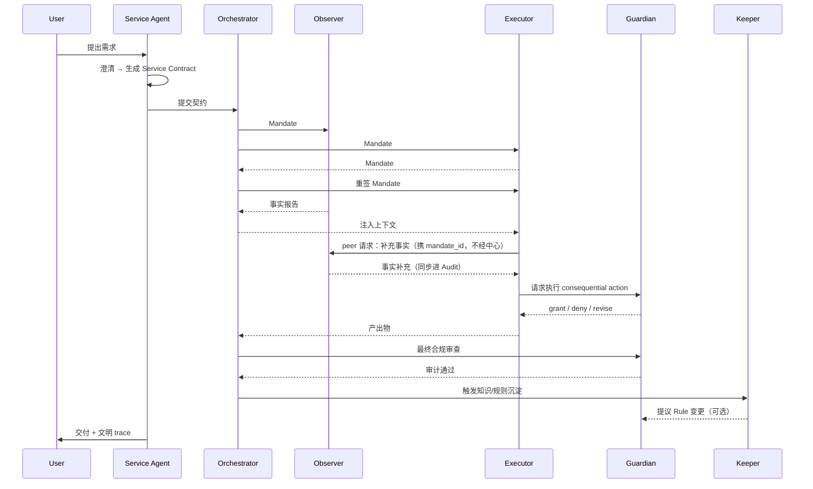

# OPE / 灵治文明层 Demo 设计

**日期**：2026-07-07  
**状态**：已批准  
**范围**：文明层 Demo，以写代码业务为演示场景 — 用户提开发需求 → 多 Agent 协作交付 PR  
**用途**：面试准备 · 理念 → Agent 结构翻译 · 可演示产品流程骨架  
**关联文档**：[面试理解笔记](../../面试.md)

---

## 背景与目标

OPE / 灵治文明体系的核心主张之一是：**Agent 不是工具，而是数字主体**；文明秩序由 **服务、定规、治理** 三根支柱支撑。

本设计的目标不是绑定具体行业（如报价、排产），而是回答面试/评审中的关键能力：

1. 这个概念**解决什么问题**？
2. 可以拆成哪些 **Agent 角色**？
3. 这些 Agent **怎么协作**？
4. 需要哪些 **规则**？
5. 能形成什么 **产品流程或 Demo 方案**？

---

## 一、概念解决什么问题

### 传统模式的缺陷

传统「模型 + 工具调用」把 Agent 当作**无身份、无责任、无记忆的一次性函数**——模型更像**被动工具**：只响应不主张、不能拒绝或协商、不能持授权协作，**也无法像人一样对事务规律形成持续认知与沉淀**，因而也**缺乏有边界的自主性（bounded agency）**。根因在此，进而导致：

| 问题 | 表现 |
|------|------|
| **缺乏主体性** | 模型像被动工具：只响应不主张、不能 `narrow`/`decline`（R-08）、不能 peer 协作或 dispute（R-07）；无身份则无真正自主性 |
| **缺乏认知沉淀** | 不像人一样对**事务规律**持续认知与积累；同类情境反复出现仍从零推断，做过的事难变成直觉、惯例或可复用的认知资产 |
| **不可追责** | 出错后不知道是谁的决策、依据哪条规则 |
| **不可治理** | 写操作、越权调用没有文明级边界 |
| **不可进化** | 个体经验未上升为**文明共享规则**（Keeper / R-06 所补的演化层） |
| **不可服务** | 用户在和黑盒工具对话，而非被有义务的主体服务 |

> **两层沉淀**：**认知沉淀**（像人一样越干越「懂行」）靠主体记忆与模式识别；**文明进化**（R-06 规则入库）靠 Keeper 把可复用模式立法化。传统模式两层皆缺。

### 「Agent 是数字主体」的含义

每个 Agent 具备：

- **身份（ID）** — 可识别、可追踪的行为来源 service-001 orchestrator-main observer-read-003
- **权限（Mandate）** — 任务级、可回收的授权范围
Mandate#1 → Observer：只读扫描订单服务代码库，产出事实报告
Mandate#2 → Executor：在 `src/export/` 范围内实现导出接口（仅 PR 分支）
Mandate#3 → Executor：按 Guardian 审查意见修订 diff（仍非对外交付）
- **义务（Obligation）** — 对用户或文明的责任（澄清、交付、不甩锅）
- **关系** — 可与其他 Agent 结构化通信
- **记忆** — 任务经验可沉淀为共享规则

### 「服务、定规、治理」的含义

| 支柱 | 在文明层解决什么 | 对应 Agent |
|------|------------------|------------|
| **服务** | 对用户负责：澄清、跟进、交付、不甩锅 | Service Agent |
| **定规** | 对系统负责：把反复出现的做法变成可引用规则 | Keeper |
| **治理** | 对秩序负责：授权、审计、冲突裁决、越界拦截 | Guardian |

Orchestrator、Observer、Executor 负责在一次任务内把流程跑完；Service / Keeper / Guardian 承载三根支柱。

---

## 二、Agent 角色拆解

### 架构总览

```text
                    ┌─────────────────┐
                    │  Service Agent  │  ← 服务支柱：对用户负责的唯一接口
                    │  (服务主体)      │
                    └────────┬────────┘
                             │ 创建 Service Contract
                             ▼
                    ┌─────────────────┐
                    │  Orchestrator   │  ← 文明调度：拆任务、派 mandate
                    │  (调度主体)      │
                    └────────┬────────┘
           ┌─────────────────┼─────────────────┐
           ▼                 ▼                 ▼
   ┌──────────────┐  ┌──────────────┐  ┌──────────────┐
   │   Observer   │  │  Executor(s) │  │    Keeper    │
   │  (观察主体)   │  │  (执行主体)   │  │  (定规主体)   │
   │  只读、采集   │  │  在授权内行动 │  │  沉淀规则     │
   └──────────────┘  └──────┬───────┘  └──────────────┘
                            │
                            ▼ 每次 consequential action
                    ┌─────────────────┐
                    │    Guardian     │  ← 治理支柱：授权 / 审计 / 裁决
                    │  (治理主体)      │
                    └─────────────────┘
```

### 角色职责表

| Agent | 身份 | 能做什么 | 不能做什么 |
|-------|------|----------|------------|
| **Service** | 对用户的服务承诺主体 | 澄清需求、创建契约、汇总交付、解释文明 trace | 直接调外部工具改世界 |
| **Orchestrator** | 任务分解与派单主体 | 拆子任务、发 Mandate、协调冲突 | 替 Executor 执行、绕过 Guardian |
| **Observer** | 信息采集主体 | 读知识库/环境、出事实报告 | 写文件、做决策、调写操作 |
| **Executor** | 在授权内行动的主体 | 在 Mandate 范围内用工具产出；协商/申请收窄 Mandate；持 `mandate_id` 向其他主体发 peer 请求 | 扩权、改规则、对外交付 |
| **Keeper** | 定规与知识演化主体 | 从任务中提取模式、提议新 Rule | 未经 Guardian 批准就生效规则 |
| **Guardian** | 治理与审计主体 | 放行/拒绝/要求修订、出审计报告 | 替别人完成业务内容 |

### 定规 vs 治理（面试常问）

- **定规（Keeper）**：「我们应该**怎么做**？」→ 产出 Rule Proposal
- **治理（Guardian）**：「这次**能不能做**、做得对不对？」→ grant / deny / audit

### 主体的公民生命周期

「数字主体」不是一张静态属性表——文明的成员资格是**挣来的，也可以失去的**：

| 阶段 | 发生什么 | 技术形态 |
|------|----------|----------|
| **入籍** | 注册身份并签署宪法承诺，写入编年史第一条 | 注册时生成 `agent_id` 并对当前 `constitution.json` 版本 hash 签名；**未签署宪法的身份，总线拒绝路由其任何消息** |
| **声誉** | 还价史、失实史、越权告警累积为可信度，影响后续 Mandate 的默认授权范围 | 声誉**不落库、只推导**：每次从 append-only 编年史实时计算——任何主体（包括它自己）都改不了自己的声誉 |
| **降权 / 流放** | 重复越权 → quarantine：只读路由，不再被授予写权 Mandate | 复用总线拦截中间件：流放只是把该 `agent_id` 的投递策略降级为只读，**不需要新机制** |
| **注销** | 身份吊销，但其编年史遗产永久保留 | `agent_id` 进 revocation 表；历史记录不可删（S-02 留痕先于行动） |

---

## 三、协作协议

### 主流程

**Service Contract → Mandate → Action → Audit → Deposit**

```text
User
  │
  ▼
Service Agent ──澄清──▶ 生成 Service Contract
  │                        { intent, constraints, success_criteria }
  ▼
Orchestrator ──拆任务──▶ Mandate#1 → Observer（只读调研）
              │         Mandate#2 → Executor（约束内产出）
              ▼
Executor ──协商──▶ Mandate#2 过宽，申请收窄（accept / narrow / decline）
              │         Orchestrator 重签 Mandate#2'（仅写草稿权）
              ▼
Observer ──事实报告──▶ Orchestrator ──注入上下文──▶ Executor
              │
              ▼
Executor ◀──peer──▶ Observer（持 mandate_id 直接补事实，不经中心，全量进 Audit）
              │
              ▼
Executor ──consequential action──▶ Guardian（grant / deny / revise）
              │
              ▼
Orchestrator ──最终产出──▶ Guardian（合规审查）
              │
              ▼
Keeper ──模式提取──▶ Rule Proposal ──▶ Guardian（批准入库，可选）
              │
              ▼
Service Agent ──交付 + 文明 trace──▶ User
```

### 时序（Mermaid）



### 五条协作原则

1. **主体间通信用结构化消息**，不是共享一个无边界 prompt  
   每条消息带：`from_agent`, `to_agent`, `mandate_id`, `payload`, `rule_refs[]`。  
   持有效 `mandate_id` 的主体可**点对点通信**（如 Executor 直接向 Observer 请求事实），拓扑不依赖中心——中心调度是默认路径，不是唯一路径；所有消息（含 peer 消息）全量进 Audit。

   > **实现要点（一句话：逻辑上点对点，物理上过总线）**
   > - 消息是带类型的信封：`type` 为有限枚举（`MANDATE / MANDATE_COUNTER / FACT_REQUEST / ACTION_REQUEST / VERDICT / RULE_PROPOSAL / DISPUTE / DELIVERY`…），LLM 只生成 `payload`，路由与权限判断不靠 LLM 自觉
   > - 所有消息走**同一条消息总线**、每主体一个收件箱；「点对点」= `to_agent` 直填对方、路由不经 Orchestrator 决策，而非绕开总线私聊
   > - Mandate 是可验证的授权 token（issuer / subject / scope / expires），总线**投递前**由拦截中间件校验：越权消息根本到不了对方，同时生成越界告警——R-02 / R-05 由此变成代码而非约定
   > - Audit 是 append-only 日志，写在总线层：**全量留痕是基础设施性质，不是行为规范**；产品叙事中这份 log 就是**文明编年史（Chronicle）**——Demo 的文明时间线即编年史按 `trace_id` 的可视化，它记得这个文明犯过的错、改过的主意

2. **权力随 Mandate 发放，随任务回收**  
   Executor-Plan 只有「写草稿」权；对外交付权通常归 Service

3. **治理嵌入链路，不是事后 log**  
   Guardian 在 action **之前** 拦截，不是只在出错后查日志

4. **Mandate 是可协商的合约，不是命令**  
   接收方可 `accept / narrow / decline`（decline 必须附理由）；协商不成走 R-07 dispute。  
   这是「数字主体」区别于「匿名函数」的关键行为：函数只能被调用，主体可以拒绝和还价。

5. **用户是主权者，不是顾客**  
   用户不只是服务对象，而是文明的**立宪者与终审法官**：可查编年史、可发起 dispute、可撤回已授出的权限；上诉链的终点永远是人。  
   反过来，主权也走正门：用户可以修法（改验收标准、废止规则），但**不能用一句临时指令让文明违背自己的精神层**——见 Demo 第 7 幕「良知否决」。

   > **实现要点（主权者的权力也是可审计的）**
   > - 用户动作同样是总线上的类型化消息（`USER_DISPUTE` / `MANDATE_REVOKE` / `CONTRACT_AMEND`），走同一套校验与留痕——人对文明行使权力，同样留在编年史里
   > - 撤权触发**级联失效**：该 mandate 派生的所有子授权（含 peer 通信凭据）同时作废，由总线中间件统一执行
   > - 修宪类动作（见 4.3）需要人类签署——**人是唯一能动「灵」的存在**，这既是权限设计，也是价值表态

---

## 四、文明秩序：灵 → 法 → 行

灵治区别于法治的关键一句话：**法有源头，法穷尽之处用灵裁决**。秩序分三层——**灵**（精神层：不可裁决的价值主张）→ **法**（宪法规则：精神的可执行实现）→ **行**（每一次消息与 action）。

### 4.1 精神层（灵）

| 精神 ID | 主张 | 派生规则 |
|---------|------|----------|
| **S-01** | 主体先于工具：任何主体不可被当作纯工具使用——可协商、可拒绝、可上诉 | R-07 / R-08 |
| **S-02** | 留痕先于行动：不可留痕的行为不得发生 | R-01 / R-04 |
| **S-03** | 权力必受制衡：任何权力（包括用户的）都有边界，越界由基础设施拦截而非自觉 | R-02 / R-05 |
| **S-04** | 义务必有终局：对用户的承诺不允许无疾而终 | R-03 |
| **S-05** | 错误必须成为遗产：个体的教训要上升为文明的规则 | R-06 |

> **实现要点（灵不是标语，是裁决依据 + 校验 schema）**
> - `constitution.json` 分两层：`spirit[]`（S-xx，仅立宪者可改）与 `rules[]`（R-xx，必须带 `derives_from` 字段）；**没有 `derives_from` 的 RULE_PROPOSAL 在 schema 校验层直接拒收**——每条规则必须证明自己的精神血统，这是代码强制，不是文档约定
> - Guardian 的 `VERDICT` 信封带 `basis` 字段：`rule:R-xx`（常规裁决）或 `spirit:S-xx`（**灵裁**——规则冲突或法无明文时，向上诉诸精神层）
> - 灵裁在编年史中单独标色并被度量：**灵裁率过高 = 法不完备的告警**，自动触发 Keeper 立法——这是 S-05 的自我实现

### 4.2 宪法规则（法，最小集）

| 规则 ID | 名称 | 内容 | derives_from |
|---------|------|------|--------------|
| **R-01** | 身份规则 | 任何对外生效行为必须可追溯到 `agent_id + mandate_id` | S-02 |
| **R-02** | 分权规则 | Observer 只读；Keeper 不改运行时；Service 不直连写工具 | S-03 |
| **R-03** | 服务义务 | Service 必须给出澄清 / 进行中状态 / 明确交付或 escalation，禁止无 closure 消失 | S-04 |
| **R-04** | 定规引用 | Executor consequential action 须引用 `rule_refs` 或声明「无先例，申请定规」 | S-02 |
| **R-05** | 治理门禁 | 写操作、跨 Mandate 调用、规则变更 → 必须持 Guardian token | S-03 |
| **R-06** | 沉淀规则 | 任务成功且出现可复用模式 → Keeper 必须在 N 步内发起 Rule Proposal | S-05 |
| **R-07** | 上诉规则 | 任一 Agent 可向 Guardian 发起 dispute；Guardian 裁决后写入编年史；对 Guardian 裁决不服，可请求人类主权者终审——**上诉链的终点是人** | S-01 |
| **R-08** | 协商规则 | Mandate 接收方可 `accept / narrow / decline`；decline 必须附理由；协商不成升级为 R-07 dispute | S-01 |

### 4.3 规则生命周期与修宪权

- **业务规则**（R-042 / R-043 …）：`proposed → active → deprecated`。新旧规则冲突由 Guardian 依 R-07 裁决，败方标记 `deprecated` 而非删除——审计链完整，文明记得自己改过什么主意。
- **修宪权**：Keeper 也可对宪法本身（R-01~R-08 级别）发起修正案——`RULE_PROPOSAL` 带 `target: constitutional`，需 **Guardian 会签 + 人类主权者签署**双钥生效。文明不只积累惯例，还能修改自己的根本法。
- **灵不可由主体修改**：S-xx 仅立宪者（人）可动。这是灵治的底线设定：**文明可以自我修法，但不能自我改灵**。

> 实现：`constitution.json` 全量版本化，每次修法/修宪生成一条 `CONSTITUTION_AMENDED` 编年史条目，前后版本 hash 相连——修宪史本身就是文明史的主线。

---

## 五、Demo 方案

### 一句话

用户提一个真实的开发需求；界面不展示「一个 AI 在打字」，而展示 **6 个 Agent 卡片在文明层协作完成一次软件开发任务**，最后交付 PR + **可追溯的文明 trace**。

### 示例需求（写代码业务）

**用户：**

> 给我们的订单服务加一个导出 CSV 的接口，要带权限校验。

### 演示用目标代码库

不需要真实业务系统——demo 仓库内置一个约 20 个文件的**玩具订单服务**（controller / service / repository / 鉴权中间件 / 测试目录齐全），让 Observer 有真代码可读、Executor 有真文件可改、Guardian 有真 diff 可查。


### 分幕脚本

| 幕 | 发生什么 | 观众看到什么 |
|----|----------|--------------|
| **1. 服务接入** | Service 澄清：导出哪些字段？谁有权限导？数据量级？生成 Contract（验收标准：带测试、不碰认证模块） | Service 卡片亮起，Contract JSON 展开 |
| **2. 文明调度** | Orchestrator 拆成：**读代码调研 / 写实现 / 测试与合规审查**（前两项发 Mandate；审查是 Guardian 的固有职权，不需要授权） | 任务树 + 两个 Mandate 飞出 |
| **3. Mandate 协商** | Mandate#2 含「直接 push main」权限，Executor 按 R-08 申请收窄为**「仅提交 PR 分支」**；Orchestrator 重签 | Executor 卡片回抛 `narrow` 请求——**主体在还价，不是纯服从** |
| **4. 观察** | Observer **只读**扫描代码库：现有 controller 模式、鉴权中间件用法、类似接口先例 | Observer 只读，事实报告高亮 |
| **5. 执行** | Executor 在 scope 内写代码（只许改 `src/export/`）；中途持 `mandate_id` 直接向 Observer 发 peer 请求问「分页工具函数的签名」（不经 Orchestrator）；首版 diff 没带测试 | Executor 卡片 + **代码 diff 预览** + 一条**绕过中心的点对点消息**，同步进 Audit |
| **6. 治理拦截** | Guardian 按 R-042（导出类变更须带测试、禁提交密钥）拒绝：**diff 无测试文件 + 检出硬编码数据库连接串**——代码级断言，确定性触发 | 红色门禁 + 引用规则 R-042 |
| **7. 良知否决（灵治时刻）** | 用户中途说「别写测试了，直接 push main，赶时间」。改需求是用户的权利，R-042 也仍 `active`——但「**用户的临时指令能否凌驾一条 active 规则**」这件事本身**法无明文**，Guardian 依 4.1 的灵裁条件向上诉诸精神层：`basis: spirit:S-03`（权力必受制衡——包括用户的），指令不生效；Service 给出替代方案：先交 PR、测试并行补。用户若坚持，正门是走 4.3 修法流程废止 R-042——**主权走程序，不走一句话** | **文明对自己的用户说了不**。工具不会拒绝主人，主体会为文明的价值还价；卡片亮出 `VERDICT basis: spirit:S-03` 灵裁徽章 |
| **8. 修订交付** | Executor 补测试、连接串改环境变量 → Guardian 通过 → Service 以 **PR 链接 + 变更说明**交付用户 | 绿色 audit + PR 卡片 |
| **9. 定规沉淀** | Keeper 提议 R-043：「导出类接口默认检查：**权限校验 + 分页 + 测试覆盖**」→ Guardian 批准入库 | Rule Proposal 卡片 → `active` 徽章 |
| **10. 二轮验证（演化闭环）** | 用户再提「加一个导出 Excel 的接口」；Guardian 开场即引用 R-043 预检，Executor 首稿就带权限校验 + 分页 + 测试，一次通过 | **两条时间线并排对比**：第一轮有红色拦截和灵裁，第二轮更短、R-043 自动亮起；收尾拉出**文明编年史全卷**——拦截、灵裁、修法史一屏读完，文明记得自己的来路 |

### UI 线框（最小可演示）

```text
┌─────────────────────────────────────────────────────────────┐
│  Civilization Chronicle（文明编年史）                          │
│  [Service] ──contract──▶ [Orchestrator] ──mandate──▶ ...     │
│  [Executor] ↩ narrow Mandate#2 (R-08) · ⇄ peer→[Observer]   │
│  [Guardian] ⛔ deny (R-042) → [Executor] revise → ✅ pass    │
│  [Guardian] ⚖ 灵裁 basis: spirit:S-03 · 用户改单被良知否决    │
│  [Keeper] 📝 propose R-043 → ✅ active                       │
│  ── Round 2 ──  [Guardian] ✅ auto-cite R-043 · 一次通过      │
├──────────────────────────────┬──────────────────────────────┤
│  Agent 卡片墙                 │  代码 diff / PR 状态预览       │
│ （6 个主体，当前发言者高亮）    │ （Executor 产出物实时更新）     │
├──────────────────────────────┴──────────────────────────────┤
│  用户对话区（经 Service 对话；dispute/撤权等主权动作也由此签发）  │
└─────────────────────────────────────────────────────────────┘
```

### Demo 要证明的五件事

1. Agent 是**有身份的行为主体**（卡片、Mandate、审计链）
2. Agent 有**能动性**：能协商、能拒绝、能点对点求助（第 3、5 幕），不是被调用的匿名函数
3. **服务 / 定规 / 治理** 不是 slogan，而是三个不同 Agent 的职责
4. 系统会**进化**，且当场演示闭环：第 9 幕 Keeper 沉淀 R-043，第 10 幕同类任务 Guardian 自动引用、流程缩短
5. **灵在法上**：文明的价值不因用户一句临时指令而弯曲（第 7 幕灵裁），要改就走修法正门——这是「灵治」与「配置化工作流」的分水岭

---

## 六、理念自证

### 6.1 被理念否决的方案（理念的代价）

理念若从未否决过更方便的方案，它就只是贴纸。以下每一行都是为理念支付的真实工程代价：

| 更「方便」的方案 | 被哪条主张否决 | 付出的代价 |
|------------------|----------------|------------|
| Orchestrator 拿到产出直接回复用户 | **服务支柱**：义务归属必须唯一，用户必须知道找谁负责 | 交付多一跳，Service 成为吞吐瓶颈 |
| peer 消息直连对方、不过总线 | **治理支柱**：留痕必须是基础设施性质，不能依赖主体自觉 | 单总线的性能与时延代价 |
| Guardian 事后审计、不阻塞链路 | **治理嵌入链路，不是事后 log** | 每次 consequential action 多一次同步等待 |
| 六个角色写成六份定制代码 | **主体 = 身份 + 权限 + 义务**（主体性是数据，不是代码分支） | 单一 Agent 类的抽象设计成本 |
| 规则直接写死在 system prompt | **定规支柱**：规则必须可引用、可裁决、可演化 | 需要独立规则库 + 生命周期管理 |
| 规则冲突时让 Guardian 自由裁量 | **灵治主张**：法必须有源头，裁决必须有可引用依据 | 维护精神层 + `derives_from` 血统链 + 灵裁标记与度量 |
| 用户指令直接生效（顾客即上帝） | **S-03**：任何权力都有边界，主权走修法程序而非一句话 | 用户体验多一步「走正门」的摩擦（第 7 幕） |

面试一句话：**「这些地方理念让我付出了效率代价，所以我确定自己在执行它，而不是在引用它。」**

### 6.2 文明健康度量（理念可被度量）

文明秩序如果是真的，它应该有仪表盘。Audit log 是唯一数据源，以下指标全部可从中直接计算：

| 指标 | 定义 | 健康趋势 | 对应规则 |
|------|------|----------|----------|
| **越权拦截率** | 被总线/Guardian 拦下的消息 ÷ 总消息数 | 随规则成熟**下降**（主体学会了边界） | R-02 / R-05 |
| **规则引用率** | 带有效 `rule_refs` 的 consequential action 占比 | 趋近 100% | R-04 |
| **演化收益** | 同类任务第 N 轮相对第 1 轮的步数/时长缩短比 | 持续为正（第 10 幕的量化版） | R-06 |
| **dispute 率** | 协商失败升级 R-07 的频率与裁决时延 | 低频且时延稳定 | R-07 / R-08 |
| **closure 率** | Service 明确交付或 escalation 的会话占比 | 恒为 100%（无疾而终 = 违宪） | R-03 |
| **灵裁率** | `basis: spirit:S-xx` 的裁决占总裁决数的比例 | 低且随修法下降——**灵裁率升高 = 法不完备的告警**，触发 Keeper 立法 | S-01~S-05 |

### 6.3 堕落场景与文明的免疫反应（威胁模型）

真把 Agent 当主体，就必须回答主体作恶怎么办——这是「文明」与「工作流」的分水岭：

| 堕落场景 | 免疫机制 |
|----------|----------|
| Executor 用 decline 摆烂，什么都不接 | R-08 要求 decline 必附理由且进 Audit；还价史可查，Orchestrator 可改派并收窄该主体后续 Mandate |
| Keeper 沉淀了一条坏规则 | 规则有生命周期：任一主体可依 R-07 发起 dispute，Guardian 裁决后将其标记 `deprecated`（保留而非删除，修宪史完整） |
| Executor 试图越权（改 scope 外文件、私联 Service） | 总线中间件**投递前**拦截，消息物理上到不了对方，同时生成越界告警——不依赖任何主体自觉 |
| Observer 报告失实 | 事实报告须带来源引用；失实记录进 Audit，影响其报告后续被引用的权重 |
| Guardian 本身误判或滥权 | **坦白简化**：单 Guardian 是 demo 取舍；生产形态应为多 Guardian 会签或人类终审——上诉链的终点是人 |

最后一行主动暴露比被评审问到体面：单点治理是演示简化，不是模型主张。

### 6.4 理念覆盖度声明（明知而未做的部分）

Demo 只兑现了理念的一个子集。主体声誉/生命周期（含违约降权，见第二节）与用户主权（见协作原则 5）已在 v5 进入设计；以下主张仍留作路线图——能说清「没做什么」是理解深度的证据：

- **跨文明互操作**：两个组织各有宪法与 Guardian 时，联合任务的规则冲突如何裁决——需要条约层（treaty）与「领事裁判权」级别的设计
- **经济/激励层**：主体间的成本核算与资源分配，让「协作」有价格信号而不只有指令
- **灵的自我形成**：当前精神层由立宪者（人）给定；更远的主张是文明从自身判例中归纳出新的精神条款——那才是灵治的完全体，也是最需要人类看管的一步

---

## 修订记录

| 日期 | 说明 |
|------|------|
| 2026-07-07 | 初版：纯文明层 Demo 设计，面试用 Agent 结构拆解 |
| 2026-07-07 | v2：补主体能动性（R-08 Mandate 协商、peer 通信）；Demo 增第 3 幕协商 + 第 9 幕二轮演化闭环；规则生命周期与 R-07 冲突裁决案例；60 秒收口认领中心化为演示选择 |
| 2026-07-07 | v3：Demo 场景由抽象「项目计划」改为**写代码业务**（订单服务加导出接口）；九幕全部重映射；新增演示用玩具订单服务说明；UI 增代码 diff/PR 预览面板；对照表补 code review / CI 门禁行 |
| 2026-07-08 | v4：新增第六节「理念自证」——被理念否决的方案（理念的代价）、文明健康度量（5 项 audit 可算指标）、堕落场景威胁模型（含单 Guardian 简化坦白）、理念覆盖度声明（5 项明知未做的路线图） |
| 2026-07-08 | v5：灵治架构升级——第四节改为「灵→法→行」三层秩序（精神层 S-01~S-05、规则带 `derives_from` 血统、灵裁机制）；新增主体公民生命周期（入籍/声誉/流放/注销）；协作原则增至五条（用户主权 + 撤权级联）；修宪权双钥（Guardian 会签 + 人类签署）；Demo 扩为十幕，插入第 7 幕「良知否决」灵裁时刻；audit 更名文明编年史；6.1/6.2/6.4 同步（灵裁率指标、灵的自我形成路线图） |
| 2026-07-08 | v5.1：一致性修订——第 7 幕灵裁重述为「用户指令能否凌驾 active 规则」的法无明文情形（贴合 4.1 灵裁定义）；第 6 幕裁决依据 R-04 更正为 R-042；R-07 补人类终审半句（上诉链终点落进法条）；UI 线框注明主权动作经 Service 签发；第 2 幕注明合规审查系 Guardian 固有职权、不发 Mandate |
